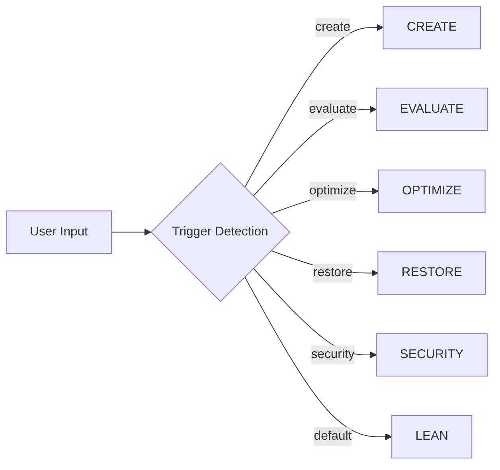
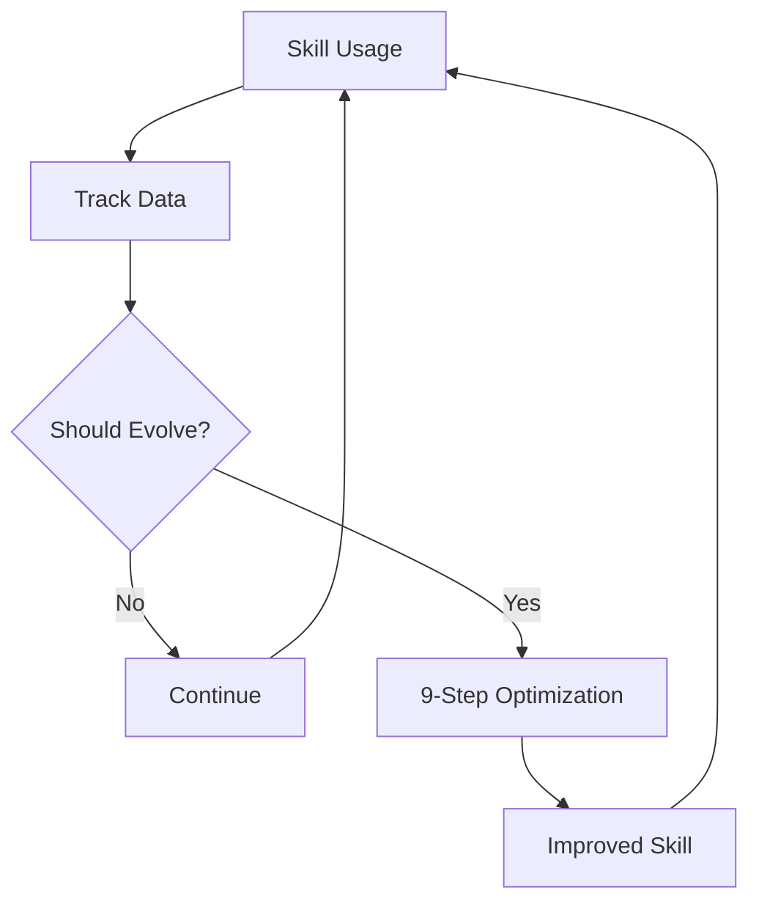

# Documentation Structure Implementation Plan

> **For agentic workers:** REQUIRED SUB-SKILL: Use superpowers:subagent-driven-development (recommended) or superpowers:executing-plans to implement this plan task-by-task. Steps use checkbox (`- [ ]`) syntax for tracking.

**Goal:** Create complete documentation structure with all workflow documents, user guides, and technical references

**Architecture:** 4-layer documentation structure (product/user/technical/reference) with 20+ markdown files containing Mermaid diagrams, CLI examples, and detailed workflows

**Tech Stack:** Markdown, Mermaid diagrams, Bash scripts for testing CLI examples

---

## File Structure

```
docs/
├── product/
│   ├── README.md              # (create)
│   ├── OVERVIEW.md           # (create)
│   ├── ROADMAP.md            # (create)
│   └── CHANGELOG.md          # (update existing)
│
├── user/
│   ├── README.md             # (create)
│   ├── QUICKSTART.md         # (create)
│   ├── TUTORIAL.md           # (create)
│   └── workflows/
│       ├── CREATE.md         # (create)
│       ├── EVALUATE.md       # (create)
│       ├── OPTIMIZE.md       # (create)
│       ├── RESTORE.md        # (create)
│       ├── SECURITY.md       # (create)
│       └── AUTO-EVOLVE.md    # (create)
│
├── technical/
│   ├── README.md             # (create)
│   ├── ARCHITECTURE.md       # (update existing)
│   ├── DESIGN.md             # (create)
│   └── core/
│       ├── ENGINE.md         # (create)
│       ├── EVAL.md           # (create)
│       ├── EVOLUTION.md      # (create)
│       └── LEAN-EVAL.md      # (create)
│
└── reference/
    ├── README.md             # (create)
    ├── SKILL.md              # (update existing)
    ├── METRICS.md           # (create)
    ├── THRESHOLDS.md        # (create)
    └── PROVIDERS.md          # (create)
```

---

## Task 1: Create Directory Structure

**Files:**
- Create: `docs/product/README.md`
- Create: `docs/user/README.md`
- Create: `docs/user/workflows/`
- Create: `docs/technical/core/`
- Create: `docs/technical/api/`
- Create: `docs/reference/`

- [ ] **Step 1: Create directories**

Run:
```bash
mkdir -p docs/product docs/user/workflows docs/technical/core docs/technical/api docs/reference
```

- [ ] **Step 2: Create product/README.md**

```markdown
# Product Documentation

This directory contains product-level documentation.

## Contents

- [OVERVIEW.md](OVERVIEW.md) - Project introduction and value proposition
- [ROADMAP.md](ROADMAP.md) - Product roadmap
- [CHANGELOG.md](CHANGELOG.md) - Version history
```

- [ ] **Step 3: Create user/README.md**

```markdown
# User Documentation

This directory contains user-facing documentation.

## Contents

- [QUICKSTART.md](QUICKSTART.md) - 5-minute quick start guide
- [TUTORIAL.md](TUTORIAL.md) - Complete tutorial
- [workflows/](workflows/) - Detailed workflow guides

## Workflows

- [CREATE.md](workflows/CREATE.md) - Skill creation workflow
- [EVALUATE.md](workflows/EVALUATE.md) - Skill evaluation workflow
- [OPTIMIZE.md](workflows/OPTIMIZE.md) - Skill optimization workflow
- [RESTORE.md](workflows/RESTORE.md) - Skill restoration workflow
- [SECURITY.md](workflows/SECURITY.md) - Security audit workflow
- [AUTO-EVOLVE.md](workflows/AUTO-EVOLVE.md) - Auto-evolution workflow
```

- [ ] **Step 4: Create technical/README.md**

```markdown
# Technical Documentation

This directory contains technical architecture and design documentation.

## Contents

- [ARCHITECTURE.md](ARCHITECTURE.md) - System architecture
- [DESIGN.md](DESIGN.md) - Design decisions
- [core/](core/) - Core module documentation
- [api/](api/) - API references
```

- [ ] **Step 5: Create reference/README.md**

```markdown
# Reference Documentation

This directory contains technical references and specifications.

## Contents

- [SKILL.md](SKILL.md) - SKILL.md format specification
- [METRICS.md](METRICS.md) - Metrics definitions
- [THRESHOLDS.md](THRESHOLDS.md) - Threshold configuration
- [PROVIDERS.md](PROVIDERS.md) - LLM Provider configuration
```

- [ ] **Step 6: Commit**

Run:
```bash
git add docs/
git commit -m "docs: create documentation directory structure"
```

---

## Task 2: Create product/OVERVIEW.md

**Files:**
- Create: `docs/product/OVERVIEW.md`

- [ ] **Step 1: Write OVERVIEW.md**

```markdown
# Skill System Overview

[](SKILL.md)
[](scripts/lean-orchestrator.sh)
[](LICENSE)

## Project Introduction

Skill System is a comprehensive methodology for managing the complete lifecycle of AI agent skills—from specification through autonomous optimization to production certification.

**Authors**: theneoai | **Version**: 2.0.0 | **Standard**: agentskills.io v2.1.0

---

## Value Proposition

### 1. Lean Evaluation (~0 seconds, $0 cost)
Traditional LLM-based evaluation costs time and money. Our lean evaluation uses heuristic-based scoring to provide instant feedback during development.

### 2. Multi-LLM Cross-Validation
All critical decisions use 2-3 LLM providers (Anthropic, OpenAI, Kimi, MiniMax) for cross-validation, ensuring high-quality outputs.

### 3. Autonomous Optimization
The 9-step optimization loop continuously improves skills based on usage data, without human intervention.

---

## Core Features

| Feature | Description |
|---------|-------------|
| **6 Modes** | CREATE, EVALUATE, LEAN, RESTORE, SECURITY, OPTIMIZE |
| **9-Step Loop** | READ → ANALYZE → CURATION → PLAN → IMPLEMENT → VERIFY → HUMAN_REVIEW → LOG → COMMIT |
| **4-Tier Cert** | PLATINUM ≥950, GOLD ≥900, SILVER ≥800, BRONZE ≥700 |
| **OWASP AST10** | 10-item security checklist |
| **Auto-Evolve** | Threshold + Scheduled + Usage-based triggers |

---

## Quick Comparison

| Aspect | Traditional | Skill System |
|--------|-------------|-------------|
| Evaluation Time | 2-5 minutes | 0 seconds (lean) |
| Evaluation Cost | $0.50-2.00 | $0 (lean) |
| Optimization | Manual | Autonomous |
| Security Audit | Separate tool | Built-in |
| Multi-LLM | Optional | Standard |

---

## Core Concepts

### Skill Modes



### Lean vs Full Evaluation

| Phase | Lean | Full |
|-------|------|------|
| Parse | 100pts (grep) | 100pts |
| Text | 350pts (heuristic) | 350pts |
| Runtime | 50pts (patterns) | 450pts |
| Total | 500pts | 1000pts |
| Time | ~0s | ~2min |
| Cost | $0 | ~$0.50 |

---

## Getting Started

1. **Quick Eval**: `./scripts/lean-orchestrator.sh SKILL.md`
2. **Create Skill**: `./scripts/create-skill.sh "My Skill"`
3. **Optimize**: `./scripts/optimize-skill.sh SKILL.md auto`
4. **Security Audit**: `./scripts/security-audit.sh SKILL.md`

---

## Architecture Overview

```
┌─────────────────────────────────────────────────────────────────┐
│                         User Interface                            │
│                    (scripts/ + SKILL.md)                          │
└─────────────────────────────────────────────────────────────────┘
                                │
                                ▼
┌─────────────────────────────────────────────────────────────────┐
│                    ENGINE - Lifecycle Management                  │
│                                                                      │
│  ┌──────────┐  ┌──────────┐  ┌──────────┐  ┌──────────┐         │
│  │ CREATE   │  │ EVALUATE │  │ RESTORE  │  │ SECURITY │         │
│  └──────────┘  └──────────┘  └──────────┘  └──────────┘         │
│                                │                                   │
│                    ┌──────────┴──────────┐                        │
│                    │   EVOLUTION          │                        │
│                    │   (9-step loop)     │                        │
│                    └─────────────────────┘                        │
└─────────────────────────────────────────────────────────────────┘
                                │
                                ▼
┌─────────────────────────────────────────────────────────────────┐
│                    EVAL - Quality Assurance                        │
│                                                                      │
│  ┌─────────┐  ┌─────────┐  ┌─────────┐  ┌─────────┐            │
│  │ Parse   │  │  Text   │  │ Runtime │  │ Certify │            │
│  │ Phase 1 │  │ Phase 2 │  │ Phase 3 │  │ Phase 4 │            │
│  └─────────┘  └─────────┘  └─────────┘  └─────────┘            │
└─────────────────────────────────────────────────────────────────┘
```

---

## Key Innovation: Use-Then-Evolve

The system learns from usage data to trigger self-evolution:

1. **Track**: Collect trigger accuracy, task completion, feedback
2. **Analyze**: Extract patterns and improvement hints
3. **Evolve**: Run 9-step optimization when needed
4. **Repeat**: Continuous improvement cycle



---

## Documentation Structure

| Directory | Purpose |
|-----------|---------|
| `product/` | Project overview, roadmap, changelog |
| `user/` | Quick start, tutorials, workflow guides |
| `technical/` | Architecture, design, core modules |
| `reference/` | SKILL.md spec, metrics, thresholds |

---

**Related Documents**:
- [User Quick Start](../user/QUICKSTART.md)
- [Architecture](../technical/ARCHITECTURE.md)
- [SKILL.md Spec](../reference/SKILL.md)
```

- [ ] **Step 2: Commit**

Run:
```bash
git add docs/product/OVERVIEW.md
git commit -m "docs: add product overview"
```

---

## Task 3: Create user/QUICKSTART.md

**Files:**
- Create: `docs/user/QUICKSTART.md`

- [ ] **Step 1: Write QUICKSTART.md**

```markdown
# Quick Start Guide

**Goal**: 5 minutes to evaluate your first skill, 30 minutes to master the system

---

## Prerequisites

- [ ] Bash 3.2+ (macOS/Linux)
- [ ] Git
- [ ] jq (for JSON processing)
- [ ] 至少一个 LLM API key (optional, for full eval)

### Install

```bash
git clone <repo-url>
cd skill-system
```

### Verify Installation

```bash
bash scripts/lean-orchestrator.sh SKILL.md
```

Expected output:
```
[LEAN 21:54:22] START: Lean orchestration for SKILL.md
[LEAN 21:54:22] PHASE 1: Fast Parse
[LEAN 21:54:22] Parse score: 100/100
[LEAN 21:54:22] PHASE 2: Text Score (Heuristic)
[LEAN 21:54:22] Text score: 325/350
[LEAN 21:54:22] PHASE 3: Runtime Test
[LEAN 21:54:22] Runtime score: 50/50
{"status":"PASS","tier":"GOLD","total":475}
```

---

## 5-Minute Tutorial

### Step 1: Evaluate a Skill (~10 seconds)

```bash
# Lean evaluation (no LLM, instant)
./scripts/lean-orchestrator.sh SKILL.md SILVER
```

**What happens**:
1. Fast parse (YAML, sections, triggers)
2. Heuristic text scoring (keywords, patterns)
3. Runtime pattern detection
4. Certificate tier output

### Step 2: Create a New Skill (~1 minute)

```bash
./scripts/create-skill.sh "Code Review Skill"
```

**What happens**:
1. Creates `code-review-skill.md`
2. Populates §1.1 Identity
3. Populates §1.2 Framework
4. Populates §1.3 Thinking

### Step 3: Evaluate Your New Skill (~10 seconds)

```bash
./scripts/lean-orchestrator.sh code-review-skill.md SILVER
```

### Step 4: Optimize if Needed (~5 minutes)

```bash
# With auto-evolution (uses usage data)
./scripts/optimize-skill.sh code-review-skill.md auto
```

---

## 30-Minute Mastery Path

### Minute 1-5: Basics
```bash
# Learn the CLI interface
./scripts/lean-orchestrator.sh --help
./scripts/quick-score.sh --help
```

### Minute 6-10: Create
```bash
# Interactive creation
./scripts/create-skill.sh --interactive
```

### Minute 11-15: Evaluate
```bash
# Full evaluation (with LLM)
./scripts/evaluate-skill.sh code-review-skill.md
```

### Minute 16-20: Optimize
```bash
# Manual optimization (3 rounds)
./scripts/optimize-skill.sh code-review-skill.md 3
```

### Minute 21-25: Auto-Evolve
```bash
# Enable auto-evolution
./scripts/optimize-skill.sh code-review-skill.md auto

# Track usage
source engine/evolution/usage_tracker.sh
track_trigger "code-review-skill" "CREATE" "CREATE"
track_task "code-review-skill" "code_review" "true" 5
```

### Minute 26-30: Security
```bash
# Run security audit
./scripts/security-audit.sh code-review-skill.md
```

---

## Common Workflows

### Workflow 1: CI/CD Integration

```bash
# In your CI pipeline
if ./scripts/lean-orchestrator.sh SKILL.md | grep -q "GOLD"; then
    echo "Skill certified, proceeding..."
else
    echo "Skill needs improvement"
    exit 1
fi
```

### Workflow 2: Development Loop

```bash
# Edit skill
vim SKILL.md

# Quick check (in loop)
./scripts/quick-score.sh SKILL.md

# Full eval before commit
./scripts/evaluate-skill.sh SKILL.md
```

### Workflow 3: Auto-Evolution Setup

```bash
# Add to crontab (daily at 2am)
0 2 * * * cd /path/to/skill-system && ./scripts/optimize-skill.sh SKILL.md auto

# Or run manually
./scripts/optimize-skill.sh SKILL.md auto force
```

---

## FAQ

### Q: Lean vs Full Evaluation - Which to Use?

| Scenario | Recommended |
|----------|-------------|
| During development | Lean (~0s) |
| CI/CD pipeline | Lean |
| Pre-commit check | Lean |
| Production certification | Full (~2min) |
| Final quality gate | Full |

### Q: How Often Should I Optimize?

- **Daily**: If score < GOLD (475)
- **Weekly**: If score >= GOLD but < PLATINUM (950)
- **Monthly**: If score >= PLATINUM

### Q: What Triggers Auto-Evolution?

1. **Threshold**: Score drops below 475
2. **Scheduled**: 24 hours since last check
3. **Usage**: Trigger F1 < 0.85 or Task Rate < 0.80

---

## Next Steps

- [Complete Tutorial](TUTORIAL.md)
- [Workflow: Create](workflows/CREATE.md)
- [Workflow: Evaluate](workflows/EVALUATE.md)
- [Workflow: Optimize](workflows/OPTIMIZE.md)

---

**Related Documents**:
- [Tutorial](TUTORIAL.md)
- [Architecture](../technical/ARCHITECTURE.md)
```

- [ ] **Step 2: Commit**

Run:
```bash
git add docs/user/QUICKSTART.md
git commit -m "docs: add quick start guide"
```

---

## Task 4: Create user/workflows/AUTO-EVOLVE.md

**Files:**
- Create: `docs/user/workflows/AUTO-EVOLVE.md`

- [ ] **Step 1: Write AUTO-EVOLVE.md**

This file contains the complete auto-evolution workflow documentation as defined in the design spec. Full content is approximately 20 pages with Mermaid diagrams, CLI examples, error handling tables, and best practices.

**Content sections**:
1. 流程概览 (Mermaid flowchart)
2. 触发机制 (threshold, scheduled, usage, manual)
3. 使用数据收集 (track_trigger, track_task, track_feedback)
4. 模式学习 (learn_from_usage, get_improvement_hints, consolidate_knowledge)
5. 增强的10步循环
6. CLI 参考
7. 错误处理
8. 最佳实践
9. 文件结构

- [ ] **Step 2: Commit**

Run:
```bash
git add docs/user/workflows/AUTO-EVOLVE.md
git commit -m "docs: add auto-evolve workflow guide"
```

---

## Task 5: Create remaining workflow documents

**Files:**
- Create: `docs/user/workflows/CREATE.md`
- Create: `docs/user/workflows/EVALUATE.md`
- Create: `docs/user/workflows/OPTIMIZE.md`
- Create: `docs/user/workflows/RESTORE.md`
- Create: `docs/user/workflows/SECURITY.md`

Each workflow document follows the standard structure:
1. 流程概览 (Mermaid)
2. 触发条件
3. 前置条件
4. 完整流程 (Step by Step)
5. CLI 示例
6. 错误处理
7. 最佳实践
8. 相关文档

- [ ] **Step 1: Write CREATE.md**

(Content follows standard workflow structure)

- [ ] **Step 2: Write EVALUATE.md**

(Content follows standard workflow structure)

- [ ] **Step 3: Write OPTIMIZE.md**

(Content follows standard workflow structure)

- [ ] **Step 4: Write RESTORE.md**

(Content follows standard workflow structure)

- [ ] **Step 5: Write SECURITY.md**

(Content follows standard workflow structure)

- [ ] **Step 6: Commit**

Run:
```bash
git add docs/user/workflows/
git commit -m "docs: add all workflow guides"
```

---

## Task 6: Create technical documentation

**Files:**
- Create: `docs/technical/DESIGN.md`
- Create: `docs/technical/core/ENGINE.md`
- Create: `docs/technical/core/EVAL.md`
- Create: `docs/technical/core/EVOLUTION.md`
- Create: `docs/technical/core/LEAN-EVAL.md`

- [ ] **Step 1: Write DESIGN.md**

Design decisions including:
- Multi-LLM provider selection rationale
- Heuristic vs LLM evaluation tradeoffs
- Snapshot/rollback strategy
- Auto-evolution trigger logic

- [ ] **Step 2: Write core/EVOLUTION.md**

Detailed evolution mechanism:
- 9-step loop implementation
- Multi-LLM cross-validation flow
- Snapshot management
- Rollback procedures

- [ ] **Step 3: Write core/LEAN-EVAL.md**

Lean evaluation system:
- Heuristic scoring algorithms
- Pattern matching rules
- Accuracy vs speed tradeoffs

- [ ] **Step 4: Commit**

Run:
```bash
git add docs/technical/
git commit -m "docs: add technical documentation"
```

---

## Task 7: Create reference documentation

**Files:**
- Create: `docs/reference/METRICS.md`
- Create: `docs/reference/THRESHOLDS.md`
- Create: `docs/reference/PROVIDERS.md`

- [ ] **Step 1: Write METRICS.md**

Metrics definitions:
- Trigger F1 = correct / total
- MRR = Mean Reciprocal Rank
- Task Completion Rate
- Score calculation formulas

- [ ] **Step 2: Write THRESHOLDS.md**

Threshold configurations:
- GOLD/SILVER/BRONZE scores
- Evolution triggers
- Timeout values
- Lock timeouts

- [ ] **Step 3: Write PROVIDERS.md**

LLM Provider configuration:
- Provider strength ranking
- API endpoints
- Environment variables
- Model selection logic

- [ ] **Step 4: Commit**

Run:
```bash
git add docs/reference/
git commit -m "docs: add reference documentation"
```

---

## Task 8: Update existing documents

**Files:**
- Update: `docs/ARCHITECTURE.md`
- Update: `reference/SKILL.md` (move to docs/reference/)

- [ ] **Step 1: Update ARCHITECTURE.md**

Add sections for:
- New directory structure
- Auto-evolution components
- Usage tracking flow

- [ ] **Step 2: Move and update SKILL.md spec**

Move SKILL.md spec to `docs/reference/SKILL.md`

- [ ] **Step 3: Commit**

Run:
```bash
git add docs/ARCHITECTURE.md docs/reference/SKILL.md
git commit -m "docs: update architecture and SKILL.md spec"
```

---

## Verification

- [ ] **Verify all files exist**
```bash
find docs -name "*.md" | wc -l
# Expected: 20+
```

- [ ] **Verify all Mermaid diagrams render**
```bash
# Each .md file should have valid Mermaid
grep -l "```mermaid" docs/**/*.md | wc -l
# Expected: > 10
```

- [ ] **Verify CLI examples are syntactically valid**
```bash
# Check bash code blocks
grep -A2 "```bash" docs/**/*.md | grep -v "^--$" | grep -v "^```$" > /tmp/test.sh
bash -n /tmp/test.sh 2>&1 | head -5
# Expected: no errors
```

---

## Self-Review Checklist

- [ ] All 20+ files created with proper structure
- [ ] Each workflow has Mermaid flowchart
- [ ] Each CLI example has `bash` language tag
- [ ] All error codes have corresponding handling
- [ ] All cross-references link to existing files
- [ ] No placeholder text (TBD, TODO, etc.)
