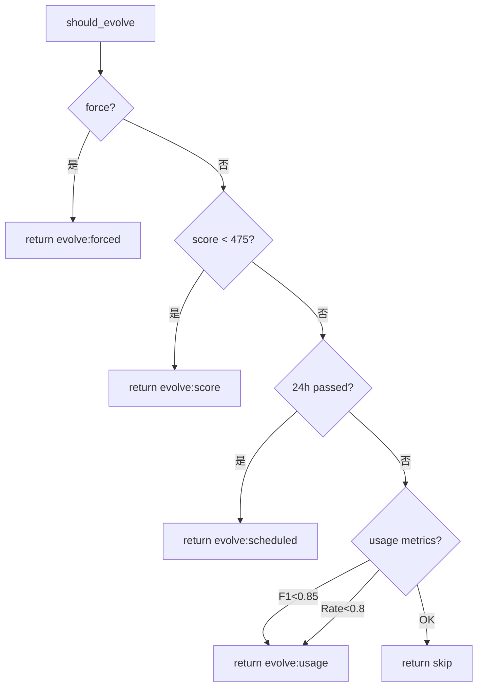

# Skill System 完整文档体系设计

> **Date**: 2026-03-28  
> **Version**: 1.0  
> **Status**: Approved

---

## 1. 概述

本文档定义了 Skill System 的完整文档体系结构，包括产品层、用户层、技术层和参考层。

### 1.1 目标

- 为内部开发者和外部用户提供清晰、完整的文档
- 详细说明每个工作流的完整流程、输入输出、错误处理
- 包含完整的 CLI 演示和代码示例

### 1.2 文档体系结构

```
docs/
├── product/                    # 产品层
│   ├── README.md              # 产品概览入口
│   ├── OVERVIEW.md            # 项目简介、价值主张
│   ├── ROADMAP.md             # 产品路线图
│   └── CHANGELOG.md           # 版本历史
│
├── user/                      # 用户层
│   ├── README.md              # 用户文档入口
│   ├── QUICKSTART.md          # 5分钟快速入门
│   ├── TUTORIAL.md            # 完整教程
│   │
│   └── workflows/             # 工作流详解
│       ├── CREATE.md          # 创建技能流程
│       ├── EVALUATE.md        # 评估技能流程
│       ├── OPTIMIZE.md        # 优化技能流程
│       ├── RESTORE.md         # 恢复技能流程
│       ├── SECURITY.md        # 安全审计流程
│       └── AUTO-EVOLVE.md     # 自动进化流程
│
├── technical/                  # 技术层
│   ├── README.md              # 技术文档入口
│   ├── ARCHITECTURE.md        # 系统架构
│   ├── DESIGN.md              # 设计决策
│   │
│   ├── core/                  # 核心模块
│   │   ├── ENGINE.md          # Engine 引擎
│   │   ├── EVAL.md            # 评估框架
│   │   ├── EVOLUTION.md       # 进化机制
│   │   └── LEAN-EVAL.md      # Lean 评估
│   │
│   └── api/                   # API 参考
│       ├── README.md
│       ├── CLI.md             # CLI 命令参考
│       └── INTERNAL.md        # 内部 API
│
└── reference/                 # 参考层
    ├── README.md              # 参考文档入口
    ├── SKILL.md              # SKILL.md 规范
    ├── METRICS.md            # 指标定义
    ├── THRESHOLDS.md         # 阈值配置
    └── PROVIDERS.md           # LLM Provider
```

---

## 2. 产品层 (product/)

### 2.1 OVERVIEW.md

**内容**:
- 项目简介 (100字)
- 价值主张 (3个核心价值点)
- 核心特性列表 (6个模式)
- 关键创新点 (Lean Eval, Multi-LLM, Auto-Evolve)
- 适用场景
- 入门指引

**格式**: Markdown + Badges

### 2.2 ROADMAP.md

**内容**:
- 当前版本 (v2.0)
- Q1/Q2/Q3/Q4 路线图
- 功能优先级
- 已知限制

### 2.3 CHANGELOG.md

**内容**:
- 按版本号组织
- 每次更新内容
- Breaking Changes
- 升级指南

---

## 3. 用户层 (user/)

### 3.1 QUICKSTART.md (5页)

**内容**:
- 前提条件 (5项)
- 5分钟快速上手 (3步)
- 30分钟精通路径
- 常见问题 (FAQ)
- 视频教程链接

**CLI 演示**:
```bash
# 1. 安装
git clone https://github.com/neoxai/skill-system.git
cd skill-system

# 2. 快速评估
./scripts/lean-orchestrator.sh SKILL.md

# 3. 创建新技能
./scripts/create-skill.sh "My First Skill"
```

### 3.2 TUTORIAL.md (10页)

**内容**:
- 完整教程：创建 → 评估 → 优化 → 部署
- 每个步骤的详细说明
- 截图和流程图
- 练习题

### 3.3 工作流文档 (workflows/)

每个工作流文档包含:

#### 通用结构

1. **流程概览** (Mermaid 流程图)
2. **触发条件** (表格形式)
3. **前置条件** (检查清单)
4. **完整流程** (Step by Step)
   - 输入
   - 输出
   - 处理逻辑 (伪代码)
   - 边界情况
5. **CLI 示例** (完整演示)
6. **错误处理** (错误码表格)
7. **最佳实践**
8. **相关文档**

#### AUTO-EVOLVE.md 详细大纲

```markdown
# 自动进化工作流

## 1. 流程概览

## 2. 触发机制

### 2.1 阈值触发
- 条件: Score < 475
- 检查函数: should_evolve()
- 决策逻辑: ...

### 2.2 定时触发
- 条件: 距上次检查 >= 24小时
- 实现: LAST_CHECK_FILE
- 重置: update_last_check()

### 2.3 使用指标触发
- Trigger F1 < 0.85
- Task Rate < 0.80
- 评分 < 3.5

### 2.4 手动触发
- force=true 参数

## 3. 双重触发决策流程



## 4. 使用数据收集

### 4.1 track_trigger()
- 输入: skill_name, expected, actual
- 输出: JSONL 条目
- 计算: correct = (expected == actual)

### 4.2 track_task()
- 输入: skill_name, task_type, completed, rounds
- 输出: JSONL 条目

### 4.3 track_feedback()
- 输入: skill_name, rating, comment
- 输出: JSONL 条目

### 4.4 get_usage_summary()
- 输入: skill_name, days
- 输出: JSON {trigger_f1, task_rate, avg_rating, stats}

## 5. 模式学习

### 5.1 learn_from_usage()
- 分析 usage_*.jsonl 文件
- 提取 weak_triggers[]
- 提取 failed_task_types[]
- 输出: patterns.json

### 5.2 get_improvement_hints()
- 基于 patterns 生成 hints
- 格式: ["hint1", "hint2", ...]

### 5.3 consolidate_knowledge()
- 生成 knowledge.md
- 包含指标状态表格
- 包含建议列表

## 6. 增强的 10 步循环

| Step | Name | Input | Output | Multi-LLM |
|------|------|-------|--------|-----------|
| 0 | USAGE_ANALYSIS | usage data | patterns, hints | No |
| 1 | READ | SKILL.md | dimension scores | Yes (3) |
| 2 | ANALYZE | dimension | strategy | Yes (3) |
| 3 | CURATION | patterns | knowledge | No |
| 4 | PLAN | strategy | improvement plan | Yes (3) |
| 5 | IMPLEMENT | plan | modified SKILL.md | Yes (1) |
| 6 | VERIFY | before/after | verified | Yes (3) |
| 7 | HUMAN_REVIEW | score | approved/skip | Manual |
| 8 | LOG | results | results.tsv | No |
| 9 | COMMIT | changes | git commit | No |

## 7. CLI 参考

```bash
# 检查是否需要进化
engine/evolution/evolve_decider.sh <skill_file> [force]

# 运行自动进化
engine/evolution/engine.sh <skill_file> auto [force]

# 手动跟踪使用数据
source engine/evolution/usage_tracker.sh
track_trigger "agent-skill" "OPTIMIZE" "OPTIMIZE"
track_task "agent-skill" "optimization" "true" 3
track_feedback "agent-skill" 5 "Great"
```

## 8. 错误处理

| 错误 | 原因 | 处理 |
|------|------|------|
| E1 | 无使用数据 | 使用默认 hints |
| E2 | LLM 超时 | 回滚快照，重试 |
| E3 | 评分下降 | 回滚，标记 stuck |
| E4 | 锁获取失败 | 等待或跳过 |

## 9. 最佳实践

1. 每次使用技能后调用 track_* 函数
2. 每周检查一次进化日志
3. 评分 > 475 时主要依赖使用触发
4. 评分 < 475 时使用阈值触发

## 10. 文件结构

```
logs/evolution/
├── usage_agent-skill_20260328.jsonl
├── usage_agent-skill_20260327.jsonl
├── patterns/
│   └── agent-skill_patterns.json
├── knowledge/
│   └── agent-skill_knowledge.md
└── .last_evolution_check
```

## 11. 相关文档

- technical/core/EVOLUTION.md
- reference/METRICS.md
- user/workflows/OPTIMIZE.md
```

---

## 4. 技术层 (technical/)

### 4.1 ARCHITECTURE.md

**内容**:
- 系统架构图 (Mermaid)
- 组件说明
- 数据流
- 部署架构

### 4.2 DESIGN.md

**内容**:
- 设计决策记录 (ADR)
- 技术选型理由
- 权衡分析

### 4.3 core/EVOLUTION.md

**内容**:
- 进化机制详细设计
- 9步循环实现细节
- 多 LLM 交叉验证逻辑
- 快照和回滚机制

---

## 5. 参考层 (reference/)

### 5.1 SKILL.md

**内容**:
- SKILL.md 文件格式规范
- 每个 section 的要求
- 示例 SKILL.md

### 5.2 METRICS.md

**内容**:
- Trigger F1 定义
- MRR 定义
- 评分计算公式

---

## 6. 实施计划

### Phase 1: 基础结构 (1天)
- 创建目录结构
- 创建 README 入口文件
- 更新现有文档

### Phase 2: 用户文档 (2天)
- QUICKSTART.md
- TUTORIAL.md
- 6个工作流文档

### Phase 3: 技术文档 (2天)
- 更新 ARCHITECTURE.md
- 创建 DESIGN.md
- 创建 core/*.md

### Phase 4: 参考文档 (1天)
- 更新 SKILL.md 规范
- METRICS.md
- THRESHOLDS.md

---

## 7. 质量标准

- 所有流程图使用 Mermaid
- 所有 CLI 示例经过测试
- 所有代码块有语言标注
- 包含完整的错误处理表格
- 每文档 < 30 页 (可分割)
