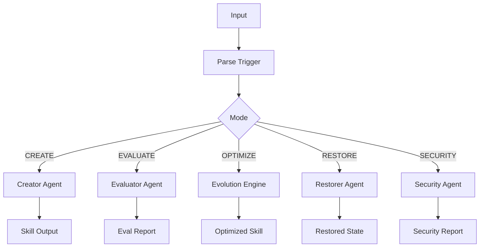

# Engine Architecture

The Skill engine is a modular system for creating, evaluating, and optimizing agent skills.

## Main Components

### Directory Structure

```
engine/
├── orchestrator.sh          # Main workflow coordinator
├── lib/
│   └── bootstrap.sh        # Shared initialization
├── orchestrator/
│   ├── _state.sh           # State management
│   ├── _workflow.sh        # Workflow control
│   ├── _actions.sh         # Operation decisions
│   └── _parallel.sh        # Parallel execution
└── evolution/
    ├── engine.sh           # 9-step optimization loop
    ├── usage_tracker.sh    # Usage analysis
    ├── evolve_decider.sh   # Evolution trigger logic
    ├── learner.sh          # Pattern learning
    └── rollback.sh        # Snapshot management
```

### Component Responsibilities

| Component | Responsibility |
|-----------|----------------|
| `orchestrator.sh` | Entry point, CLI interface, workflow coordination |
| `agents/` | Creator, Evaluator, Restorer, Security agents |
| `evolution/` | 9-step self-optimization loop |
| `lib/` | Shared utilities, constants, error handling |

## Orchestrator Flow



### CLI Interface

```bash
# Create a new skill
./orchestrator.sh "<user_prompt>" "./output/SKILL.md" [target_tier]

# Modes are determined by parsing the input trigger
```

## Agent System

### Base Agent Interface

All agents follow a common interface:

```bash
agent_call_llm() {
    local system_prompt="$1"
    local user_prompt="$2"
    local mode="$3"
    local provider="$4"
    
    # Provider selection with fallback
    # LLM API call with error handling
    # Response parsing and validation
}
```

### Multi-LLM Deliberation

Critical decisions require multi-LLM deliberation:

```bash
multi_llm_locate_weakest() {
    # Three providers vote on weakest dimension
    r1=$(llm_score_dimensions "anthropic" "$skill_file")
    r2=$(llm_score_dimensions "openai" "$skill_file")
    r3=$(llm_score_dimensions "kimi" "$skill_file")
    
    # 2/3 agreement required
    # Third opinion on disagreement
}
```

### Error Handling

Each agent implements:
- Retry logic with exponential backoff
- Timeout handling
- Graceful degradation
- Error logging and reporting

## Workflow States

```
┌─────────────────────────────────────────────────────┐
│                  WORKFLOW STATES                    │
├─────────────────────────────────────────────────────┤
│  INIT → PARSING → EXECUTING → VERIFYING → COMPLETE │
│                ↓         ↓                          │
│              FAILED    ROLLBACK                     │
└─────────────────────────────────────────────────────┘
```

## Lock Management

Concurrent operations are protected by file-based locks:

```bash
acquire_lock "evolution" "$EVOLUTION_TIMEOUT" || {
    echo "Error: Failed to acquire evolution lock"
    exit 1
}
trap "release_lock 'evolution'" EXIT
```
