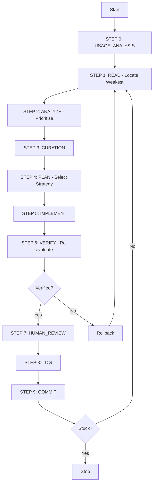

# Evolution Mechanism

The evolution engine (`engine/evolution/engine.sh`) implements a self-optimization loop for continuous skill improvement.

## 10-Step Optimization Loop



### Step 0: USAGE_ANALYSIS (Auto Mode Only)

```bash
if [[ $current_round -eq 1 ]] && [[ -n "$patterns" ]]; then
    hints=$(get_improvement_hints "${PATTERNS_DIR}/${skill_name}_patterns.json")
    consolidate_knowledge "$skill_name"
fi
```

### Steps 1-9: The Core Loop

| Step | Name | Multi-LLM | Description |
|------|------|-----------|-------------|
| 1 | READ | Yes | Locate weakest dimension via 3-provider voting |
| 2 | ANALYZE | Yes | Prioritize improvement strategy |
| 3 | CURATION | No | Consolidate optimization knowledge (every 10 rounds) |
| 4 | PLAN | Yes | Select and plan specific improvement |
| 5 | IMPLEMENT | Yes | Apply change with snapshot |
| 6 | VERIFY | Yes | Re-evaluate and verify score improvement |
| 7 | HUMAN_REVIEW | No | Request review if score < 8.0 after 10 rounds |
| 8 | LOG | No | Record round to results.tsv |
| 9 | COMMIT | No | Git commit if needed |

## Multi-LLM Deliberation

### Three Providers, Cross-Validation

```bash
multi_llm_locate_weakest() {
    r1=$(llm_score_dimensions "anthropic" "$skill_file")
    r2=$(llm_score_dimensions "openai" "$skill_file")
    r3=$(llm_score_dimensions "kimi" "$skill_file")
    
    # 2/3 agreement required
    if [[ "$dim1" == "$dim2" ]] || [[ "$dim1" == "$dim3" ]]; then
        weakest="$dim1"
        confidence=0.9
    elif [[ "$dim2" == "$dim3" ]]; then
        weakest="$dim2"
        confidence=0.85
    else
        weakest="$dim1"
        confidence=0.6  # Request human review
    fi
}
```

### Agreement Thresholds

| Agreement | Confidence | Action |
|-----------|------------|--------|
| 3/3 | 0.95 | Proceed with high confidence |
| 2/3 | 0.85-0.90 | Proceed with normal confidence |
| 0/3 | 0.60 | Low confidence, request human review |

## Snapshot Management

### Pre-Round Snapshots

```bash
create_snapshot "$skill_file" "pre_round_$current_round"
```

### Rollback Triggers

```bash
# Score verification failed
if [[ "$verify_result" == "rollback" ]]; then
    rollback_to_snapshot "$skill_file" "pre_round_$current_round"
fi

# Implementation verification failed
if [[ "$impl_verified" == "false" ]]; then
    rollback_to_snapshot "$skill_file" "pre_round_$current_round"
fi
```

### Automatic Cleanup

Maximum 10 snapshots retained per skill. Oldest are automatically cleaned up after each evolution cycle.

## Stuck Detection

```bash
if [[ $stuck_count -ge 5 ]]; then
    echo "Stuck for 5 rounds, stopping"
    break
fi
```

### Stuck Criteria

- 5 consecutive rounds with no score improvement
- Triggers automatic stop
- Human review suggestion generated

## Dimension Scoring

```bash
DIMENSIONS=(
    "System Prompt:20"
    "Domain Knowledge:20"
    "Workflow:20"
    "Error Handling:15"
    "Examples:15"
    "Metadata:10"
    "Long-Context:10"
)
```

## Results Tracking

```bash
RESULTS_TSV="${LOG_DIR}/optimization_results.tsv"
# Format: round\tdimension\told_score\tnew_score\tdelta\tconfidence\tllm_consensus
```

## Usage Learning (Auto Mode)

```bash
learn_from_usage() {
    local skill_file="$1"
    local days="${2:-7}"
    # Analyze usage patterns from last 7 days
    # Generate improvement hints
}
```
