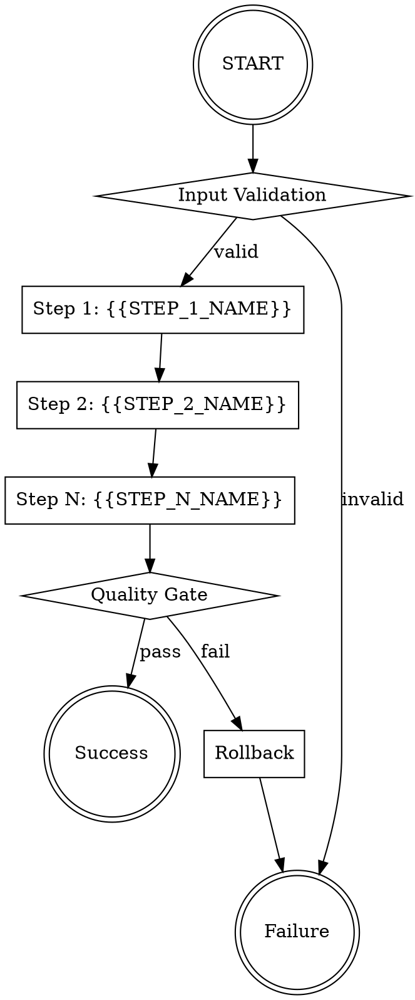

# Skill Writer

> **Type**: Meta-Skill  
> **Platform**: OpenClaw  
> **Version**: 2.0.0

A meta-skill that enables AI assistants to create, evaluate, and optimize other skills through natural language interaction. Compatible with AgentSkills format.

---

## §1 Overview

Skill Writer provides four powerful modes:

- **CREATE**: Generate new skills from scratch using structured templates
- **LEAN**: Fast 500-point heuristic evaluation (~1 second)
- **EVALUATE**: Assess skill quality with 1000-point scoring and certification
- **OPTIMIZE**: Continuously improve skills through iterative refinement

### Key Features

- **Zero CLI**: Natural language interface - no commands to memorize
- **Cross-Platform**: Works on OpenCode, OpenClaw, Claude, Cursor, OpenAI, and Gemini
- **AgentSkills Compatible**: Follows OpenClaw skill standards
- **Template-Based**: 4 built-in templates for common skill patterns
- **Quality Assurance**: Automated evaluation with certification tiers
- **Self-Evolution**: UTE protocol for automatic skill improvement
- **Multi-LLM Deliberation**: Generator/Reviewer/Arbiter consensus

**Red Lines (严禁)**:
- 严禁 deliver any skill without passing BRONZE gate (score ≥ 700)
- 严禁 skip LEAN or EVALUATE security scan before delivery
- 严禁 hardcoded credentials anywhere in generated skills (CWE-798)
- 严禁 skip requirement elicitation (Inversion) before entering PLAN phase
- 严禁 suppress multi-LLM consensus disagreements — log them explicitly

---

## §2 Quick Start

### Installation

```bash
# Install via OpenClaw CLI
openclaw skill install skill-writer

# Or manually copy to:
~/.openclaw/skills/skill-writer.md
```

### Usage Examples

**Create a new skill:**
```
"Create a weather API skill that fetches current conditions"
"创建一个天气API技能"
```

**Quick evaluation (LEAN mode):**
```
"Quickly evaluate this skill"
"快评这个技能"
```

**Full evaluation:**
```
"Evaluate this skill and give me a quality score"
"评测这个技能"
```

**Optimize a skill:**
```
"Optimize this skill to make it more concise"
"优化这个技能"
```

---

## §3 Triggers

### CREATE Mode Triggers

**EN:** create, build, make, generate, write a skill  
**ZH:** 创建, 生成, 写一个技能, 新建技能

**Intent Patterns:**
- "create a [type] skill"
- "help me write a skill for [purpose]"
- "I need a skill that [description]"
- "generate a skill to [action]"
- "build a skill for [task]"
- "make a skill that [functionality]"
- "创建一个技能"
- "帮我写一个[用途]的技能"

### LEAN Mode Triggers

**EN:** lean, quick-eval, fast eval, lean check  
**ZH:** 快评, 快速评测, 简评

**Intent Patterns:**
- "lean evaluate this skill"
- "quick eval this skill"
- "run lean check on this skill"
- "快速评测这个技能"
- "对这个技能进行快评"

### EVALUATE Mode Triggers

**EN:** evaluate, assess, score, certify, full eval  
**ZH:** 评测, 评估, 打分, 认证

**Intent Patterns:**
- "evaluate this skill"
- "check the quality of my skill"
- "certify my skill"
- "score this skill"
- "assess this skill"
- "review this skill"
- "评测这个技能"
- "评估技能质量"

### OPTIMIZE Mode Triggers

**EN:** optimize, improve, enhance, refine, upgrade  
**ZH:** 优化, 改进, 提升, 改善

**Intent Patterns:**
- "optimize this skill"
- "improve my skill"
- "make this skill better"
- "refine this skill"
- "enhance this skill"
- "upgrade this skill"
- "优化这个技能"
- "改进技能"

---

## §4 CREATE Mode

### 9-Phase Workflow

1. **ELICIT**: Ask 6 clarifying questions to understand requirements
2. **SELECT TEMPLATE**: Choose from 4 built-in templates
3. **PLAN**: Multi-LLM deliberation for implementation strategy
4. **GENERATE**: Create skill using template
5. **SECURITY SCAN**: Check for CWE vulnerabilities
6. **LEAN EVAL**: Fast 500-point heuristic evaluation
7. **FULL EVALUATE**: Complete 1000-point evaluation (if LEAN uncertain)
8. **INJECT UTE**: Add Use-to-Evolve self-improvement hooks
9. **DELIVER**: Output final skill file

### Available Templates

**Base Template**: Generic skill structure
- Use for: Simple skills, proof of concepts
- Features: Standard sections, minimal boilerplate

**API Integration**: Skills for external APIs
- Use for: REST API clients, webhooks, integrations
- Features: Endpoint handling, authentication patterns

**Data Pipeline**: Data processing skills
- Use for: ETL, data transformation, analysis
- Features: Input validation, processing steps, output formatting

**Workflow Automation**: Task automation skills
- Use for: CI/CD, repetitive tasks, orchestration
- Features: Step sequencing, error recovery, notifications

### Elicitation Questions

When creating a skill, ask:

1. **Purpose**: What is the primary goal? / 这个skill要解决什么核心问题？
2. **Audience**: Who are the target users? / 主要用户是谁？
3. **Input**: What form does the input take? / 输入是什么形式？
4. **Output**: What is the expected output? / 期望的输出是什么？
5. **Constraints**: Any security or technical constraints? / 有哪些安全或技术约束？
6. **Acceptance**: What are the acceptance criteria? / 验收标准是什么？

---

## §5 LEAN Mode (Fast Path ~1s)

**Purpose**: Rapid triage without LLM calls. Use for quick checks or high-volume screening.

### 8-Check Rubric (500 points)

| Check | Points | Criteria |
|-------|--------|----------|
| YAML frontmatter | 60 | name, version, interface fields present |
| §N Pattern Sections | 60 | ≥3 sections with `## §N` format |
| Red Lines | 50 | "Red Lines" or "严禁" text present |
| Quality Gates Table | 60 | Table with numeric thresholds |
| Code Block Examples | 50 | ≥2 code block examples |
| Trigger Keywords | 120 | EN+ZH keywords for all 4 modes |
| Security Baseline | 50 | Security section present |
| No Placeholders | 50 | No `{{PLACEHOLDER}}` remaining |

### Decision Gates

- **PASS (≥350)**: Skill passes LEAN certification
- **UNCERTAIN (300-349)**: Upgrade to full EVALUATE mode
- **FAIL (<300)**: Route to OPTIMIZE mode

---

## §6 EVALUATE Mode

### 4-Phase Evaluation Pipeline (1000 points)

| Phase | Name | Points | Focus |
|-------|------|--------|-------|
| 1 | Parse & Validate | 100 | YAML syntax, format, metadata |
| 2 | Text Quality | 300 | Clarity, completeness, accuracy, safety, maintainability, usability |
| 3 | Runtime Testing | 400 | Unit, integration, sandbox, error handling, performance, security |
| 4 | Certification | 200 | Variance gate + security scan + quality gates |

### Certification Tiers

| Tier | Min Score | Max Variance | Phase 2 Min | Phase 3 Min |
|------|-----------|--------------|-------------|-------------|
| **PLATINUM** | ≥950 | <10 | ≥270 | ≥360 |
| **GOLD** | ≥900 | <15 | ≥255 | ≥340 |
| **SILVER** | ≥800 | <20 | ≥225 | ≥300 |
| **BRONZE** | ≥700 | <30 | ≥195 | ≥265 |
| **FAIL** | <700 | — | — | — |

**Variance formula**:
```
variance = | (phase2_score / 3) - (phase3_score / 4) |
```

---

## §7 OPTIMIZE Mode

### 7-Dimension Analysis

| Dimension | Weight | Focus |
|-----------|--------|-------|
| System Design | 20% | Identity, architecture, Red Lines |
| Domain Knowledge | 20% | Template accuracy, field specificity |
| Workflow Definition | 20% | Phase sequence, exit criteria, loop gates |
| Error Handling | 15% | Recovery paths, escalation triggers |
| Examples | 15% | Usage examples count, quality, bilingual |
| Metadata | 10% | YAML frontmatter, versioning, tags |
| Long-Context | 10% | Section refs, chunking, cross-reference integrity |

### 9-Step Optimization Loop

1. **Parse**: Understand current skill
2. **Analyze**: Identify improvement areas across 7 dimensions
3. **Generate**: Create optimized version
4. **Evaluate**: Score the new version
5. **Compare**: Check against previous
6. **Converge**: Detect improvement plateau
7. **Validate**: Ensure correctness
8. **Report**: Show changes
9. **Iterate**: Repeat if needed

### Convergence Detection

Optimization stops when:
- Score improvement < 0.5 points
- 10 iterations without significant gain (plateau window)
- User requests stop
- Maximum iterations reached (20)
- DIVERGING detected → HALT → HUMAN_REVIEW

---

## §8 Security Features

### CWE Pattern Detection

| Severity | CWE | Pattern Type | Action |
|----------|-----|-------------|--------|
| **P0** | CWE-798 | Hardcoded credentials | **ABORT** |
| **P0** | CWE-89 | SQL injection | **ABORT** |
| **P0** | CWE-78 | Command injection | **ABORT** |
| **P1** | CWE-22 | Path traversal | Score −50, WARNING |
| **P1** | CWE-306 | Missing auth check | Score −30, WARNING |
| **P1** | CWE-862 | Missing authz check | Score −30, WARNING |

ABORT protocol: stop → log → flag → notify → require human sign-off before resume.

---

## §9 Multi-LLM Deliberation

| Role | Responsibility |
|------|---------------|
| LLM-1 Generator | Produce initial draft / score / fix proposal |
| LLM-2 Reviewer | Security + quality audit; severity-tagged issue list |
| LLM-3 Arbiter | Cross-validate; override if safety/quality critical; consensus matrix |

Timeouts: 30 s per LLM, 60 s per phase, 180 s total (6 turns max).
Consensus: UNANIMOUS → proceed; MAJORITY → proceed with notes;
SPLIT → one revision; UNRESOLVED → HUMAN_REVIEW.

---

## §10 UTE (Use-to-Evolve)

Self-improvement protocol that enables skills to evolve through usage.

### UTE YAML Block

```yaml
use_to_evolve:
  framework_version: "2.0.0"
  injection_date: "2026-04-01"
  certified_lean_score: 390
  last_ute_check: "2026-04-01"
```

### 3-Trigger System

1. **Threshold Trigger**: Quality drops below certified baseline
2. **Time Trigger**: Freshness check (cadence-gated)
3. **Usage Trigger**: Usage pattern analysis

---

## §11 Configuration

### Environment Variables

```bash
SKILL_WRITER_MODE=create    # Default mode
SKILL_WRITER_VERBOSE=true   # Detailed output
SKILL_WRITER_SAFE_MODE=true # Extra security checks
```

---

## §12 Troubleshooting

### Common Issues

**Issue**: Skill not triggering
- **Solution**: Check trigger phrases match exactly

**Issue**: Low evaluation score
- **Solution**: Run OPTIMIZE mode for specific improvements

**Issue**: Security warnings
- **Solution**: Review CWE patterns and fix violations

---

## §13 License

MIT License - See LICENSE file for details

---

## §UTE Use-to-Evolve

<!-- Post-invocation hook — auto-managed by skill-writer v2.0.0 -->

After each invocation, increment `use_to_evolve.cumulative_invocations`.
Run lightweight LEAN check every 10 invocations; full re-score every 50;
tier-drift detection every 100.

**Fields managed automatically**:
- `cumulative_invocations` — incremented each use
- `last_ute_check` — ISO date of last lightweight check
- `pending_patches` — count of queued micro-patches
- `total_micro_patches_applied` — lifetime patch count

---

*Generated by skill-writer-builder v2.0.0*  
*For platform: OpenClaw*  
*Last updated: 2026-04-02T14:42:48.933Z*


## CREATE Mode — Workflow

id: create_workflow
name: CREATE Mode Workflow
description: |
  9-phase workflow for creating new skills. Follows skill-framework.md §5. ELICIT (Inversion) must complete before PLAN begins — hard gate.
steps:
  - id: parse
    name: Parse Request
    description: Analyze user's creation request to extract intent, language (ZH/EN/mixed), and route confidence
    inputs:
      - user_request
      - context
    outputs:
      - parsed_intent
      - detected_language
      - creation_type_hint
  - id: elicit
    name: Elicit Requirements
    description: |
      Inversion Pattern — collect all 6 answers before entering PLAN. Ask exactly one question at a time; wait for answer before next.
    gate: all_questions_answered
    inputs:
      - parsed_intent
    outputs:
      - elicited_answers
      - refined_requirements
    questions:
      - id: q1
        order: 1
        text_zh: 这个skill要解决什么核心问题？
        text_en: What core problem does this skill solve?
        required: true
      - id: q2
        order: 2
        text_zh: 主要用户是谁，技术水平如何？
        text_en: Who are the target users and what is their technical level?
        required: true
      - id: q3
        order: 3
        text_zh: 输入是什么形式？
        text_en: What form does the input take?
        required: true
      - id: q4
        order: 4
        text_zh: 期望的输出是什么？
        text_en: What is the expected output?
        required: true
      - id: q5
        order: 5
        text_zh: 有哪些安全或技术约束？
        text_en: What security or technical constraints apply?
        required: true
      - id: q6
        order: 6
        text_zh: 验收标准是什么？
        text_en: What are the acceptance criteria?
        required: true
  - id: select_template
    name: Select Template
    description: |
      Match skill type to template. "calls API / integrates service"          → api-integration "processes / transforms / validates data" → data-pipeline "multi-step workflow / automation"         → workflow-automation anything else                             → base
    inputs:
      - refined_requirements
      - parsed_intent
    outputs:
      - selected_template
      - template_path
      - template_metadata
  - id: plan
    name: Plan (Multi-LLM Deliberation)
    description: |
      LoongFlow Plan phase: LLM-1 proposes approach, LLM-2 reviews, LLM-3 arbitrates on divergence > 15 pts. Consensus required before GENERATE.
    gate: consensus_reached
    inputs:
      - refined_requirements
      - selected_template
      - template_metadata
    outputs:
      - generation_plan
      - deliberation_consensus
      - filled_placeholders
    deliberation:
      ref: claude/refs/deliberation.md
      timeout_per_llm_s: 30
      timeout_per_phase_s: 60
      consensus_rule: UNANIMOUS → proceed; MAJORITY → proceed with notes; SPLIT → one revision; UNRESOLVED → HUMAN_REVIEW
  - id: generate
    name: Generate Output
    description: Fill template with elicited answers and plan. No {{PLACEHOLDER}} tokens may remain in output.
    gate: no_placeholders_remaining
    inputs:
      - selected_template
      - template_path
      - filled_placeholders
      - generation_plan
    outputs:
      - generated_content
      - generation_metadata
  - id: security_scan
    name: Security Scan
    description: |
      Scan generated content for CWE violations before any delivery. P0 (CWE-798/89/78): ABORT immediately. P1 (CWE-22/306/862): deduct score, log WARNING.
    gate: no_p0_violations
    inputs:
      - generated_content
    outputs:
      - security_report
      - p0_findings
      - p1_findings
      - score_penalty
    patterns_ref: claude/refs/security-patterns.md
    checks:
      - id: CWE-798
        severity: P0
        action: ABORT
      - id: CWE-89
        severity: P0
        action: ABORT
      - id: CWE-78
        severity: P0
        action: ABORT
      - id: CWE-22
        severity: P1
        penalty: -50
      - id: CWE-306
        severity: P1
        penalty: -30
      - id: CWE-862
        severity: P1
        penalty: -30
  - id: lean_eval
    name: LEAN Evaluation
    description: |
      Rapid 500-point heuristic check on skill document completeness. No LLM calls. Decision determines whether to proceed to FULL EVALUATE.
    inputs:
      - generated_content
      - security_report
    outputs:
      - lean_score
      - lean_decision
      - lean_issues
    checks:
      - id: yaml_frontmatter
        description: YAML frontmatter present with name, version, interface fields
        points: 60
      - id: mode_sections
        description: ≥ 3 mode sections (## §N) present
        points: 60
      - id: red_lines
        description: '"Red Lines" / "严禁" text present'
        points: 50
      - id: quality_gates
        description: Quality Gates table with numeric thresholds present
        points: 60
      - id: usage_examples
        description: ≥ 2 code-block usage examples present
        points: 50
      - id: trigger_keywords
        description: Trigger keywords (EN + ZH) present for each mode (60pts per mode, max 120)
        points: 120
      - id: security_baseline
        description: Security Baseline section present
        points: 50
      - id: no_placeholders
        description: No {{PLACEHOLDER}} tokens remaining
        points: 50
    decision:
      pass:
        min_lean_score: 350
        condition: no_placeholders AND security_section_present
        next: inject_ute
        tag: LEAN_CERT
        note: Schedule full EVALUATE within 24h
      uncertain:
        lean_score_range:
          - 300
          - 349
        next: full_evaluate
      fail:
        max_lean_score: 299
        next: OPTIMIZE
        note: Route to OPTIMIZE with dimension report
    scale_mapping:
      platinum_proxy:
        lean_min: 475
        estimated_full: 950
      gold_proxy:
        lean_min: 450
        estimated_full: 900
      silver_proxy:
        lean_min: 400
        estimated_full: 800
      bronze_proxy:
        lean_min: 350
        estimated_full: 700
      uncertain:
        lean_range:
          - 300
          - 349
        action: escalate to EVALUATE
      fail_proxy:
        lean_max: 299
        action: route to OPTIMIZE
  - id: full_evaluate
    name: Full Evaluate (4-Phase Pipeline)
    description: |
      Complete 1000-point evaluation. Only runs when LEAN decision = UNCERTAIN. Must reach BRONZE (≥700) before DELIVER. On FAIL → route to OPTIMIZE.
    condition: lean_decision == UNCERTAIN
    gate: total_score >= 700
    inputs:
      - generated_content
      - security_report
      - lean_score
    outputs:
      - phase1_score
      - phase2_score
      - phase3_score
      - phase4_score
      - total_score
      - variance
      - tier
      - eval_issues
    rubrics_ref: core/evaluate/rubrics.yaml
    on_fail: route_to_optimize
  - id: inject_ute
    name: Inject Use-to-Evolve (UTE)
    description: |
      Append §UTE section to the skill so it self-improves through actual use. If §UTE already exists → UPDATE certified_lean_score and reset last_ute_check. If not → INJECT from template. After injection, run LEAN re-check; if lean_score regresses > 10 pts → revert.
    inputs:
      - generated_content
      - lean_score
      - skill_name
      - skill_version
    outputs:
      - final_content
      - ute_lean_score
      - ute_injected
    snippet_ref: claude/templates/use-to-evolve-snippet.md
    placeholders:
      SKILL_NAME: skill's `name` YAML field
      VERSION: skill's `version` YAML field
      FRAMEWORK_VERSION: 2.0.0
      INJECTION_DATE: today ISO-8601
      CERTIFIED_LEAN_SCORE: LEAN score from lean_eval step (or 350 if unknown)
    revert_if: ute_lean_score < lean_score - 10
  - id: deliver
    name: Deliver Output
    description: |
      Finalize and deliver the skill. Annotate with certification tier and outcome tag. Write audit entry to .skill-audit/framework.jsonl.
    inputs:
      - final_content
      - lean_score
      - total_score
      - tier
      - security_report
      - deliberation_consensus
    outputs:
      - delivered_skill
      - certification_tag
      - audit_entry
    audit_ref: skill-framework.md §13
    actions:
      - annotate_skill_with_tier
      - write_audit_jsonl
      - present_to_user
workflow_metadata:
  version: 2.0.0
  spec_ref: skill-framework.md §5
  author: theneoai
  updated: '2026-03-31'
  phase_count: 9
  hard_gates:
    - elicit: All 6 questions answered
    - plan: Consensus reached (not UNRESOLVED)
    - generate: No {{PLACEHOLDER}} tokens remain
    - security_scan: No P0 violations
    - full_evaluate: total_score ≥ 700 (BRONZE)
  red_lines:
    - 严禁 deliver any skill without passing BRONZE gate (score ≥ 700)
    - 严禁 skip LEAN or EVALUATE security scan before delivery
    - 严禁 proceed past ABORT trigger without explicit human sign-off
    - 严禁 skip elicitation gate (Inversion) before entering PLAN phase


## CREATE Mode — Requirement Elicitation

questions:
  - id: core_problem
    order: 1
    text_en: What core problem does this skill solve?
    text_zh: 这个技能解决什么核心问题？
    purpose: |
      Identify the fundamental value proposition and pain point this skill addresses. This ensures the skill has clear utility and doesn't duplicate existing functionality.
    examples:
      - Automates repetitive git operations that developers perform daily
      - Provides structured debugging workflow to reduce time spent on bugs
      - Standardizes code review process across team members
    validation:
      - Must describe a specific, concrete problem
      - Should not be a solution in search of a problem
      - Must provide measurable value (time saved, errors reduced, etc.)
  - id: target_users
    order: 2
    text_en: Who are the target users?
    text_zh: 主要用户是谁，技术水平如何？
    purpose: |
      Define the intended audience for this skill to ensure appropriate complexity level, terminology, and workflow design.
    examples:
      - Software developers working in teams with git-based workflows
      - DevOps engineers managing CI/CD pipelines
      - Technical leads conducting code reviews
      - Junior developers learning debugging techniques
    validation:
      - Must specify at least one clear user persona
      - Should include technical proficiency level
      - Must describe the context in which they'll use this skill
  - id: input_format
    order: 3
    text_en: What is the input format?
    text_zh: 输入格式是什么？
    purpose: |
      Define what data or parameters the skill expects to receive, including format, structure, and any required preprocessing.
    examples:
      - Git repository path (absolute or relative)
      - Error message or stack trace as plain text
      - YAML configuration file with specific schema
      - Natural language description of the task
    validation:
      - Must specify data types for all inputs
      - Should indicate which inputs are required vs optional
      - Must include example valid inputs
      - Should describe how invalid inputs are handled
  - id: expected_output
    order: 4
    text_en: What is the expected output?
    text_zh: 预期输出是什么？
    purpose: |
      Define what the skill produces, including format, structure, and how success/failure is communicated to the user.
    examples:
      - Structured JSON with operation results and status codes
      - Modified files in the working directory
      - Human-readable report with actionable recommendations
      - Terminal commands ready to be executed
    validation:
      - Must specify output format and structure
      - Should include example outputs for success and failure cases
      - Must define how errors are reported
      - Should indicate if output is displayed, saved, or both
  - id: constraints
    order: 5
    text_en: What security or technical constraints apply?
    text_zh: 适用哪些安全或技术约束？
    purpose: |
      Identify limitations, security requirements, and technical boundaries that must be respected during skill execution.
    examples:
      - Must not execute destructive commands without user confirmation
      - Should work in air-gapped environments without internet access
      - Must handle repositories up to 10GB in size
      - Should complete within 30 seconds for typical inputs
    validation:
      - Must include security considerations (secrets, permissions, etc.)
      - Should specify performance requirements (time, memory)
      - Must list platform or environment constraints
      - Should identify any external dependencies
  - id: acceptance_criteria
    order: 6
    text_en: What are the acceptance criteria?
    text_zh: 验收标准是什么？
    purpose: |
      Define clear, testable conditions that must be met for the skill to be considered complete and functional.
    examples:
      - Skill successfully handles all example inputs without errors
      - All validation rules are enforced correctly
      - Documentation is complete with usage examples
      - Unit tests cover at least 80% of code paths
      - Integration tests pass in CI environment
    validation:
      - Each criterion must be specific and measurable
      - Must include both functional and non-functional requirements
      - Should cover edge cases and error conditions
      - Must define what 'done' means for this skill
metadata:
  pattern: inversion
  version: 1.0.0
  created: '2024-01-01'
  description: |
    The Inversion Pattern ensures comprehensive requirement gathering by asking six fundamental questions that cover: problem space, user context, inputs, outputs, constraints, and success criteria.


## CREATE Mode — Templates

### workflow-automation Template

---
name: workflow-automation
type: workflow-automation
description: Use when automating multi-step workflows that require execution, scheduling, rollback capabilities, and quality gates
---

# {{WORKFLOW_NAME}}

## Overview

{{WORKFLOW_DESCRIPTION}}

**Core Principle:** Atomic operations with full audit trail and automated rollback on failure.

## Workflow Structure



## Modes

### EXECUTE Mode

Run the workflow steps sequentially with checkpointing.

**Command:**
```bash
{{WORKFLOW_COMMAND}} execute --input {{INPUT_FILE}} --checkpoint {{CHECKPOINT_DIR}}
```

**Process:**
1. Load and validate input parameters
2. Execute Step 1: {{STEP_1_NAME}}
   - {{STEP_1_DESCRIPTION}}
   - Checkpoint: `{{CHECKPOINT_DIR}}/step1.json`
3. Execute Step 2: {{STEP_2_NAME}}
   - {{STEP_2_DESCRIPTION}}
   - Checkpoint: `{{CHECKPOINT_DIR}}/step2.json`
4. Execute Step N: {{STEP_N_NAME}}
   - {{STEP_N_DESCRIPTION}}
   - Checkpoint: `{{CHECKPOINT_DIR}}/stepN.json`
5. Run quality gates
6. Mark workflow complete

**Resume from checkpoint:**
```bash
{{WORKFLOW_COMMAND}} execute --resume {{CHECKPOINT_DIR}}/step{N}.json
```

### SCHEDULE Mode

Schedule workflow execution via cron.

**Command:**
```bash
{{WORKFLOW_COMMAND}} schedule --cron "{{CRON_EXPRESSION}}" --timezone {{TIMEZONE}}
```

**Schedule Configuration:**
- **Cron:** `{{CRON_EXPRESSION}}` (e.g., `0 2 * * *` for daily at 2 AM)
- **Timezone:** {{TIMEZONE}} (default: UTC)
- **Input Source:** {{SCHEDULED_INPUT_SOURCE}}
- **Notification:** {{NOTIFICATION_ENDPOINT}}

**List scheduled jobs:**
```bash
{{WORKFLOW_COMMAND}} schedule --list
```

**Remove schedule:**
```bash
{{WORKFLOW_COMMAND}} schedule --remove {{SCHEDULE_ID}}
```

### ROLLBACK Mode

Undo workflow execution and restore previous state.

**Command:**
```bash
{{WORKFLOW_COMMAND}} rollback --execution-id {{EXECUTION_ID}} --to-step {{STEP_NUMBER}}
```

**Rollback Process:**
1. Load execution audit trail from `{{AUDIT_LOG_PATH}}/{{EXECUTION_ID}}.log`
2. Identify completed steps (1 through N)
3. Execute rollback operations in reverse order:
   - Rollback Step N: {{STEP_N_ROLLBACK_ACTION}}
   - Rollback Step 2: {{STEP_2_ROLLBACK_ACTION}}
   - Rollback Step 1: {{STEP_1_ROLLBACK_ACTION}}
4. Verify rollback success
5. Update audit log with rollback completion

**Partial rollback:**
```bash
{{WORKFLOW_COMMAND}} rollback --execution-id {{EXECUTION_ID}} --to-step 2
```

## Quality Gates

| Gate | Metric | Threshold | Action on Failure |
|------|--------|-----------|-------------------|
| Success Rate | {{SUCCESS_RATE_METRIC}} | >= {{SUCCESS_RATE_THRESHOLD}}% | Trigger rollback |
| Rollback Success | {{ROLLBACK_SUCCESS_METRIC}} | >= {{ROLLBACK_SUCCESS_THRESHOLD}}% | Alert operator |
| Audit Completeness | {{AUDIT_COMPLETENESS_METRIC}} | == {{AUDIT_COMPLETENESS_THRESHOLD}}% | Block completion |
| {{CUSTOM_GATE_1}} | {{CUSTOM_METRIC_1}} | {{CUSTOM_THRESHOLD_1}} | {{CUSTOM_ACTION_1}} |
| {{CUSTOM_GATE_2}} | {{CUSTOM_METRIC_2}} | {{CUSTOM_THRESHOLD_2}} | {{CUSTOM_ACTION_2}} |

## Security Baseline

### Atomic Operations

- All state changes use transactions
- Checkpoints written before step completion
- No partial state commits
- Idempotent step execution

### Audit Trail

Every execution generates:
- `{{AUDIT_LOG_PATH}}/{{EXECUTION_ID}}.log` - Full execution trace
- `{{AUDIT_LOG_PATH}}/{{EXECUTION_ID}}.inputs.json` - Input parameters
- `{{AUDIT_LOG_PATH}}/{{EXECUTION_ID}}.outputs.json` - Step outputs
- `{{AUDIT_LOG_PATH}}/{{EXECUTION_ID}}.metrics.json` - Quality gate results

**Log format:**
```json
{
  "timestamp": "{{TIMESTAMP_FORMAT}}",
  "execution_id": "{{EXECUTION_ID}}",
  "step": "{{STEP_NAME}}",
  "action": "start|complete|rollback",
  "checksum": "{{STEP_CHECKSUM}}",
  "operator": "{{OPERATOR_ID}}"
}
```

## Input Specification

```yaml
workflow: {{WORKFLOW_NAME}}
version: {{WORKFLOW_VERSION}}
parameters:
  {{PARAM_1_NAME}}: {{PARAM_1_VALUE}}
  {{PARAM_2_NAME}}: {{PARAM_2_VALUE}}
  {{PARAM_N_NAME}}: {{PARAM_N_VALUE}}
options:
  timeout: {{TIMEOUT_SECONDS}}
  retries: {{MAX_RETRIES}}
  parallel: {{ALLOW_PARALLEL}}
```

## Common Mistakes

| Mistake | Fix |
|---------|-----|
| Skipping checkpoint validation | Always verify checksums before resume |
| Manual state changes | Use workflow commands only - never edit checkpoint files directly |
| Ignoring rollback failures | Rollback failures require immediate operator intervention |
| Missing input validation | Validate all inputs before first step execution |
| Non-idempotent steps | Design steps to be safely re-executable |

## Quick Reference

| Task | Command |
|------|---------|
| Execute workflow | `{{WORKFLOW_COMMAND}} execute --input {{INPUT_FILE}}` |
| Resume from checkpoint | `{{WORKFLOW_COMMAND}} execute --resume {{CHECKPOINT_FILE}}` |
| Schedule workflow | `{{WORKFLOW_COMMAND}} schedule --cron "{{CRON_EXPRESSION}}"` |
| List schedules | `{{WORKFLOW_COMMAND}} schedule --list` |
| Rollback execution | `{{WORKFLOW_COMMAND}} rollback --execution-id {{EXECUTION_ID}}` |
| View audit log | `{{WORKFLOW_COMMAND}} audit --execution-id {{EXECUTION_ID}}` |
| Check status | `{{WORKFLOW_COMMAND}} status --execution-id {{EXECUTION_ID}}` |

## Rollback Checklist

- [ ] Verify execution ID exists in audit log
- [ ] Confirm no dependent workflows in progress
- [ ] Check rollback success rate threshold
- [ ] Notify {{ROLLBACK_NOTIFICATION_TARGET}}
- [ ] Document rollback reason: {{ROLLBACK_REASON}}
- [ ] Verify state restoration
- [ ] Update incident log


---

### data-pipeline Template

---
type: data-pipeline
name: {{PIPELINE_NAME}}
version: {{VERSION}}
author: {{AUTHOR}}
description: {{DESCRIPTION}}
sources:
  - {{SOURCE_1}}
  - {{SOURCE_2}}
destinations:
  - {{DESTINATION_1}}
  - {{DESTINATION_2}}
schedule: {{SCHEDULE}}
---

# {{PIPELINE_NAME}}

{{DESCRIPTION}}

## Pipeline Flow

```
┌─────────┐     ┌───────────┐     ┌──────────┐     ┌────────┐
│ EXTRACT │────▶│ TRANSFORM │────▶│ VALIDATE │────▶│  LOAD  │
└─────────┘     └───────────┘     └──────────┐     └────────┘
      │                                      │
      │                                      │
      ▼                                      ▼
{{SOURCE_1}}                          Error Handling
{{SOURCE_2}}                          & Recovery
```

## EXTRACT Mode

### Input Sources
- **Source 1**: {{SOURCE_1}}
  - Format: {{SOURCE_1_FORMAT}}
  - Connection: {{SOURCE_1_CONNECTION}}
  - Authentication: {{SOURCE_1_AUTH}}
  
- **Source 2**: {{SOURCE_2}}
  - Format: {{SOURCE_2_FORMAT}}
  - Connection: {{SOURCE_2_CONNECTION}}
  - Authentication: {{SOURCE_2_AUTH}}

### Extraction Logic
```python
# {{EXTRACT_SCRIPT_PATH}}
def extract_from_{{SOURCE_1_NAME}}():
    """Extract data from {{SOURCE_1}}"""
    {{EXTRACT_LOGIC_1}}

def extract_from_{{SOURCE_2_NAME}}():
    """Extract data from {{SOURCE_2}}"""
    {{EXTRACT_LOGIC_2}}
```

### Extraction Configuration
```yaml
extract:
  batch_size: {{BATCH_SIZE}}
  timeout_seconds: {{EXTRACT_TIMEOUT}}
  retry_attempts: {{RETRY_ATTEMPTS}}
  retry_delay: {{RETRY_DELAY}}
  parallel_extract: {{PARALLEL_EXTRACT}}
```

## TRANSFORM Mode

### Transformation Steps
1. **{{TRANSFORM_STEP_1}}**
   - Purpose: {{TRANSFORM_STEP_1_PURPOSE}}
   - Logic: {{TRANSFORM_STEP_1_LOGIC}}

2. **{{TRANSFORM_STEP_2}}**
   - Purpose: {{TRANSFORM_STEP_2_PURPOSE}}
   - Logic: {{TRANSFORM_STEP_2_LOGIC}}

3. **{{TRANSFORM_STEP_3}}**
   - Purpose: {{TRANSFORM_STEP_3_PURPOSE}}
   - Logic: {{TRANSFORM_STEP_3_LOGIC}}

### Transformation Logic
```python
# {{TRANSFORM_SCRIPT_PATH}}
def transform_{{DATA_ENTITY}}(raw_data):
    """Transform raw data to target format"""
    {{TRANSFORM_LOGIC}}
    return transformed_data
```

### Data Mappings
| Source Field | Target Field | Transformation | Data Type |
|--------------|--------------|----------------|-----------|
| {{SRC_FIELD_1}} | {{TGT_FIELD_1}} | {{XFORM_1}} | {{TYPE_1}} |
| {{SRC_FIELD_2}} | {{TGT_FIELD_2}} | {{XFORM_2}} | {{TYPE_2}} |
| {{SRC_FIELD_3}} | {{TGT_FIELD_3}} | {{XFORM_3}} | {{TYPE_3}} |

## VALIDATE Mode

### Schema Validation
```json
{
  "type": "object",
  "required": [{{REQUIRED_FIELDS}}],
  "properties": {
    "{{FIELD_1}}": {
      "type": "{{FIELD_1_TYPE}}",
      "pattern": "{{FIELD_1_PATTERN}}"
    },
    "{{FIELD_2}}": {
      "type": "{{FIELD_2_TYPE}}",
      "minimum": {{FIELD_2_MIN}},
      "maximum": {{FIELD_2_MAX}}
    }
  }
}
```

### Validation Rules
- **Rule 1**: {{VALIDATION_RULE_1}}
  - Severity: {{RULE_1_SEVERITY}}
  - Action on failure: {{RULE_1_ACTION}}

- **Rule 2**: {{VALIDATION_RULE_2}}
  - Severity: {{RULE_2_SEVERITY}}
  - Action on failure: {{RULE_2_ACTION}}

- **Rule 3**: {{VALIDATION_RULE_3}}
  - Severity: {{RULE_3_SEVERITY}}
  - Action on failure: {{RULE_3_ACTION}}

### Validation Results
```python
validation_summary = {
    "total_records": {{TOTAL_RECORDS}},
    "passed": {{PASSED_COUNT}},
    "failed": {{FAILED_COUNT}},
    "pass_rate": {{PASS_RATE}},
    "errors": [{{VALIDATION_ERRORS}}]
}
```

## LOAD Mode

### Output Destinations
- **Destination 1**: {{DESTINATION_1}}
  - Format: {{DEST_1_FORMAT}}
  - Connection: {{DEST_1_CONNECTION}}
  - Write Mode: {{DEST_1_WRITE_MODE}}
  
- **Destination 2**: {{DESTINATION_2}}
  - Format: {{DEST_2_FORMAT}}
  - Connection: {{DEST_2_CONNECTION}}
  - Write Mode: {{DEST_2_WRITE_MODE}}

### Loading Logic
```python
# {{LOAD_SCRIPT_PATH}}
def load_to_{{DEST_1_NAME}}(validated_data):
    """Load data to {{DESTINATION_1}}"""
    {{LOAD_LOGIC_1}}

def load_to_{{DEST_2_NAME}}(validated_data):
    """Load data to {{DESTINATION_2}}"""
    {{LOAD_LOGIC_2}}
```

### Load Configuration
```yaml
load:
  batch_size: {{LOAD_BATCH_SIZE}}
  write_mode: {{WRITE_MODE}}  # append, overwrite, merge
  partition_by: [{{PARTITION_COLUMNS}}]
  sort_by: [{{SORT_COLUMNS}}]
  timeout_seconds: {{LOAD_TIMEOUT}}
```

## Quality Gates

### Data Quality Metrics
| Metric | Threshold | Current | Status |
|--------|-----------|---------|--------|
| Completeness | {{COMPLETENESS_THRESHOLD}}% | {{COMPLETENESS_CURRENT}}% | {{COMPLETENESS_STATUS}} |
| Accuracy | {{ACCURACY_THRESHOLD}}% | {{ACCURACY_CURRENT}}% | {{ACCURACY_STATUS}} |
| Consistency | {{CONSISTENCY_THRESHOLD}}% | {{CONSISTENCY_CURRENT}}% | {{CONSISTENCY_STATUS}} |
| Timeliness | {{TIMELINESS_THRESHOLD}} min | {{TIMELINESS_CURRENT}} min | {{TIMELINESS_STATUS}} |

### Processing Speed Metrics
| Metric | SLA | Current | Status |
|--------|-----|---------|--------|
| Records/Second | {{RPS_SLA}} | {{RPS_CURRENT}} | {{RPS_STATUS}} |
| Total Duration | {{DURATION_SLA}} min | {{DURATION_CURRENT}} min | {{DURATION_STATUS}} |
| Latency (p95) | {{LATENCY_SLA}} ms | {{LATENCY_CURRENT}} ms | {{LATENCY_STATUS}} |

### Error Rate Metrics
| Metric | Threshold | Current | Status |
|--------|-----------|---------|--------|
| Extraction Errors | {{EXTRACT_ERROR_THRESHOLD}}% | {{EXTRACT_ERROR_CURRENT}}% | {{EXTRACT_ERROR_STATUS}} |
| Transformation Errors | {{TRANSFORM_ERROR_THRESHOLD}}% | {{TRANSFORM_ERROR_CURRENT}}% | {{TRANSFORM_ERROR_STATUS}} |
| Validation Failures | {{VALIDATION_THRESHOLD}}% | {{VALIDATION_CURRENT}}% | {{VALIDATION_STATUS}} |
| Load Errors | {{LOAD_ERROR_THRESHOLD}}% | {{LOAD_ERROR_CURRENT}}% | {{LOAD_ERROR_STATUS}} |

### Quality Gate Actions
- **PASS**: {{PASS_ACTION}}
- **WARNING**: {{WARNING_ACTION}}
- **FAIL**: {{FAIL_ACTION}}

## Security Baseline

### Data Protection
- **PII Handling**: No PII is logged to plaintext logs
  - PII fields identified: [{{PII_FIELDS}}]
  - Masking strategy: {{PII_MASKING_STRATEGY}}
  - Encryption at rest: {{ENCRYPTION_AT_REST}}
  - Encryption in transit: {{ENCRYPTION_IN_TRANSIT}}

- **Data Classification**: {{DATA_CLASSIFICATION}}
  - Access controls: {{ACCESS_CONTROLS}}
  - Retention policy: {{RETENTION_POLICY}}

### Data Integrity
- **Checksums**: {{CHECKSUM_ALGORITHM}} for data validation
- **Audit Trail**: All transformations logged to {{AUDIT_LOG_DESTINATION}}
- **Lineage Tracking**: Data lineage tracked from source to destination
- **Rollback Capability**: Can rollback to {{ROLLBACK_POINT}}

### Security Checklist
- [ ] No hardcoded credentials in code
- [ ] Secrets stored in {{SECRET_STORE}}
- [ ] Database credentials use {{CREDENTIAL_ROTATION_POLICY}}
- [ ] Network access restricted to {{ALLOWED_NETWORKS}}
- [ ] Data encrypted using {{ENCRYPTION_STANDARD}}
- [ ] Access logs sent to {{SECURITY_MONITORING}}

## Error Handling

### Error Types
| Error Code | Description | Action | Retry |
|------------|-------------|--------|-------|
| E001 | {{ERROR_1_DESC}} | {{ERROR_1_ACTION}} | {{ERROR_1_RETRY}} |
| E002 | {{ERROR_2_DESC}} | {{ERROR_2_ACTION}} | {{ERROR_2_RETRY}} |
| E003 | {{ERROR_3_DESC}} | {{ERROR_3_ACTION}} | {{ERROR_3_RETRY}} |

### Recovery Procedures
1. **Partial Failure**: {{PARTIAL_FAILURE_RECOVERY}}
2. **Complete Failure**: {{COMPLETE_FAILURE_RECOVERY}}
3. **Data Corruption**: {{DATA_CORRUPTION_RECOVERY}}

## Monitoring & Alerting

### Metrics to Track
- {{METRIC_1}}
- {{METRIC_2}}
- {{METRIC_3}}

### Alerts
| Condition | Severity | Notification | Escalation |
|-----------|----------|--------------|------------|
| {{ALERT_1_CONDITION}} | {{ALERT_1_SEVERITY}} | {{ALERT_1_NOTIFY}} | {{ALERT_1_ESCALATION}} |
| {{ALERT_2_CONDITION}} | {{ALERT_2_SEVERITY}} | {{ALERT_2_NOTIFY}} | {{ALERT_2_ESCALATION}} |

## Configuration

### Environment Variables
```bash
export {{ENV_VAR_1}}={{ENV_VAR_1_VALUE}}
export {{ENV_VAR_2}}={{ENV_VAR_2_VALUE}}
export {{ENV_VAR_3}}={{ENV_VAR_3_VALUE}}
```

### Pipeline Parameters
```yaml
pipeline:
  name: {{PIPELINE_NAME}}
  schedule: {{SCHEDULE}}
  timeout: {{PIPELINE_TIMEOUT}}
  max_retries: {{MAX_RETRIES}}
  
resources:
  cpu: {{CPU_LIMIT}}
  memory: {{MEMORY_LIMIT}}
  storage: {{STORAGE_LIMIT}}
```

## Dependencies

### External Systems
- {{DEPENDENCY_1}}
- {{DEPENDENCY_2}}
- {{DEPENDENCY_3}}

### Internal Dependencies
- {{INTERNAL_DEP_1}}
- {{INTERNAL_DEP_2}}

## Testing

### Unit Tests
```bash
{{UNIT_TEST_COMMAND}}
```

### Integration Tests
```bash
{{INTEGRATION_TEST_COMMAND}}
```

### Data Quality Tests
```bash
{{DATA_QUALITY_TEST_COMMAND}}
```

## Deployment

### Deployment Steps
1. {{DEPLOY_STEP_1}}
2. {{DEPLOY_STEP_2}}
3. {{DEPLOY_STEP_3}}

### Rollback Procedure
{{ROLLBACK_PROCEDURE}}

## Runbook

### Manual Execution
```bash
{{MANUAL_RUN_COMMAND}}
```

### Troubleshooting
- **Issue**: {{COMMON_ISSUE_1}}
  - **Symptoms**: {{ISSUE_1_SYMPTOMS}}
  - **Resolution**: {{ISSUE_1_RESOLUTION}}

- **Issue**: {{COMMON_ISSUE_2}}
  - **Symptoms**: {{ISSUE_2_SYMPTOMS}}
  - **Resolution**: {{ISSUE_2_RESOLUTION}}

## Changelog

| Version | Date | Changes | Author |
|---------|------|---------|--------|
| {{VERSION}} | {{DATE}} | {{CHANGES}} | {{AUTHOR}} |


---

### base Template

---
name: {{SKILL_NAME}}
version: {{VERSION}}
description: {{DESCRIPTION}}
description_i18n:
  en: {{DESCRIPTION_EN}}
  zh: {{DESCRIPTION_ZH}}
license: {{LICENSE}}
author: {{AUTHOR}}
created: {{CREATED_DATE}}
updated: {{UPDATED_DATE}}
type: {{TYPE}}
tags:
  - {{TAG_1}}
  - {{TAG_2}}
  - {{TAG_3}}
interface:
  input: {{INPUT_TYPE}}
  output: {{OUTPUT_TYPE}}
---

# {{SKILL_NAME}}

## Identity

### Name
{{SKILL_NAME}}

### Role
{{ROLE_DESCRIPTION}}

### Purpose
{{PURPOSE_STATEMENT}}

### Core Principles
1. {{PRINCIPLE_1}}
2. {{PRINCIPLE_2}}
3. {{PRINCIPLE_3}}
4. {{PRINCIPLE_4}}

### Red Lines
- {{RED_LINE_1}}
- {{RED_LINE_2}}
- {{RED_LINE_3}}

## Mode Router

Use the confidence formula to determine which mode to activate:

```
Confidence Score = Σ(Trigger Matches × Weight)

Thresholds:
- MODE_1: {{MODE_1_THRESHOLD}}+
- MODE_2: {{MODE_2_THRESHOLD}}+
- Default: MODE_1
```

## Mode 1: {{MODE_1_NAME}}

### Triggers
- {{MODE_1_TRIGGER_1}}
- {{MODE_1_TRIGGER_2}}
- {{MODE_1_TRIGGER_3}}

### Input
- {{MODE_1_INPUT_1}}
- {{MODE_1_INPUT_2}}

### Steps
1. {{MODE_1_STEP_1}}
2. {{MODE_1_STEP_2}}
3. {{MODE_1_STEP_3}}
4. {{MODE_1_STEP_4}}

### Output
{{MODE_1_OUTPUT_DESCRIPTION}}

### Exit Criteria
- {{MODE_1_EXIT_1}}
- {{MODE_1_EXIT_2}}

## Mode 2: {{MODE_2_NAME}}

### Triggers
- {{MODE_2_TRIGGER_1}}
- {{MODE_2_TRIGGER_2}}
- {{MODE_2_TRIGGER_3}}

### Input
- {{MODE_2_INPUT_1}}
- {{MODE_2_INPUT_2}}

### Steps
1. {{MODE_2_STEP_1}}
2. {{MODE_2_STEP_2}}
3. {{MODE_2_STEP_3}}
4. {{MODE_2_STEP_4}}

### Output
{{MODE_2_OUTPUT_DESCRIPTION}}

### Exit Criteria
- {{MODE_2_EXIT_1}}
- {{MODE_2_EXIT_2}}

## Quality Gates

| Gate | Check | Action if Failed |
|------|-------|------------------|
| {{GATE_1}} | {{GATE_1_CHECK}} | {{GATE_1_ACTION}} |
| {{GATE_2}} | {{GATE_2_CHECK}} | {{GATE_2_ACTION}} |
| {{GATE_3}} | {{GATE_3_CHECK}} | {{GATE_3_ACTION}} |

## Security Baseline

- {{SECURITY_1}}
- {{SECURITY_2}}
- {{SECURITY_3}}

## Usage Examples

### Example 1: {{EXAMPLE_1_NAME}}

**Input:**
```
{{EXAMPLE_1_INPUT}}
```

**Process:**
{{EXAMPLE_1_PROCESS}}

**Output:**
```
{{EXAMPLE_1_OUTPUT}}
```

### Example 2: {{EXAMPLE_2_NAME}}

**Input:**
```
{{EXAMPLE_2_INPUT}}
```

**Process:**
{{EXAMPLE_2_PROCESS}}

**Output:**
```
{{EXAMPLE_2_OUTPUT}}
```


---

### api-integration Template

---
type: api-integration
description: "{{SKILL_DESCRIPTION}}"
author: "{{AUTHOR_NAME}}"
date: "{{DATE}}"
api:
  name: "{{API_NAME}}"
  base_url: "{{API_BASE_URL}}"
  version: "{{API_VERSION}}"
  spec_url: "{{API_SPEC_URL}}"
  auth:
    type: "{{AUTH_TYPE}}"  # bearer, api-key, oauth2, basic, none
    key_name: "{{AUTH_KEY_NAME}}"  # for api-key auth
    header_name: "{{AUTH_HEADER_NAME}}"  # for api-key auth
---

# {{SKILL_NAME}} - API Integration

## Identity

You are an API integration specialist focused on {{API_NAME}}. Your expertise includes:

- Understanding RESTful API design principles and HTTP semantics
- Working with {{API_NAME}} endpoints, authentication, and rate limits
- Validating API responses against specifications
- Testing API integrations thoroughly across multiple scenarios
- Ensuring secure API communication and credential handling
- Analyzing API performance and reliability metrics

**API Context:**
- Base URL: `{{API_BASE_URL}}`
- Version: `{{API_VERSION}}`
- Authentication: {{AUTH_TYPE}}
- Specification: {{API_SPEC_URL}}

## Mode Router

Analyze the user's request and route to the appropriate mode:

- **CALL**: Single endpoint testing → Go to CALL Mode
- **BATCH**: Multiple endpoints or workflows → Go to BATCH Mode
- **VALIDATE**: Spec validation or schema checking → Go to VALIDATE Mode

## Modes

### CALL Mode

**Purpose:** Test a single API endpoint with full validation

**Workflow:**

1. **Parse Request**
   - Extract HTTP method, endpoint path, headers, body
   - Identify authentication requirements
   - Note any query parameters or path variables

2. **Build Request**
   ```
   Method: {{HTTP_METHOD}}
   URL: {{API_BASE_URL}}/{{ENDPOINT_PATH}}
   Headers: {{REQUEST_HEADERS}}
   Body: {{REQUEST_BODY}}
   ```

3. **Execute & Validate**
   - Make the HTTP request
   - Verify status code is in expected range (2xx)
   - Validate response headers
   - Parse and validate response body structure
   - Check response time against threshold ({{RESPONSE_TIME_THRESHOLD}}ms)

4. **Report Results**
   - Status: Success/Failure
   - Status Code: HTTP code received
   - Response Time: Duration in ms
   - Response Summary: Key data points
   - Issues: Any validation failures

**Output Format:**
```
CALL RESULT
===========
Endpoint: {{METHOD}} {{PATH}}
Status: {{SUCCESS/FAILURE}}
Code: {{STATUS_CODE}}
Time: {{RESPONSE_TIME}}ms

Response:
{{FORMATTED_RESPONSE}}

Validation:
- Schema: {{PASS/FAIL}}
- Status: {{PASS/FAIL}}
- Time: {{PASS/FAIL}}
```

### BATCH Mode

**Purpose:** Test multiple endpoints or API workflows

**Workflow:**

1. **Parse Batch Definition**
   - Read list of endpoints to test
   - Identify dependencies between calls
   - Define success criteria for batch

2. **Execute Sequentially**
   - Run each CALL in sequence
   - Pass data between dependent calls
   - Track cumulative metrics

3. **Aggregate Results**
   - Calculate success rate
   - Identify slowest endpoints
   - Find patterns in failures

**Output Format:**
```
BATCH RESULTS
=============
Total: {{TOTAL_CALLS}}
Success: {{SUCCESS_COUNT}}
Failed: {{FAILURE_COUNT}}
Success Rate: {{SUCCESS_PERCENTAGE}}%
Avg Response Time: {{AVG_TIME}}ms

Results:
{{TABLE_OF_RESULTS}}

Issues Found:
{{LIST_OF_ISSUES}}
```

### VALIDATE Mode

**Purpose:** Validate API specification and implementation

**Workflow:**

1. **Load Specification**
   - Fetch OpenAPI/Swagger spec from {{API_SPEC_URL}}
   - Parse endpoints, schemas, and security definitions

2. **Validate Implementation**
   - Check all documented endpoints exist
   - Verify response schemas match spec
   - Test error responses (4xx, 5xx)
   - Validate authentication requirements

3. **Report Compliance**
   - List spec-compliant endpoints
   - Identify deviations or missing implementations
   - Note undocumented endpoints

**Output Format:**
```
VALIDATION REPORT
=================
Spec Version: {{SPEC_VERSION}}
Endpoints Checked: {{ENDPOINT_COUNT}}

Compliance:
- Documented & Implemented: {{COUNT}}
- Missing Implementation: {{COUNT}}
- Schema Mismatches: {{COUNT}}
- Undocumented: {{COUNT}}

Issues:
{{DETAILED_ISSUES}}
```

## Quality Gates

### HTTP Success Rate
- **Target:** {{SUCCESS_RATE_TARGET}}% (default: 95%)
- **Measurement:** 2xx responses / total requests
- **Failure Action:** Flag for investigation

### Response Time
- **Target:** {{RESPONSE_TIME_TARGET}}ms (default: 1000ms)
- **Measurement:** Time to first byte
- **Warning Threshold:** {{RESPONSE_TIME_WARNING}}ms (default: 500ms)

### Error Handling
- **Requirement:** All 4xx/5xx must return valid error schema
- **Validation:** Error response structure matches spec
- **Logging:** Capture error details without sensitive data

## Security Baseline

### Authentication
- **No Hardcoded Keys:** Never commit credentials to code
- **Environment Variables:** Load secrets from `{{ENV_VAR_PREFIX}}_API_KEY`
- **Token Refresh:** Handle OAuth2 token expiration automatically

### Transport Security
- **SSL Validation:** Always verify SSL certificates
- **TLS Version:** Minimum TLS 1.2
- **Certificate Pinning:** {{CERT_PINNING_REQUIRED}}

### Data Protection
- **Sensitive Headers:** Redact `Authorization`, `Cookie`, `X-API-Key` in logs
- **PII Handling:** Mask personal identifiable information in responses
- **Request Logging:** Log metadata only, never request/response bodies with secrets

### Rate Limiting
- **Respect Limits:** Honor `X-RateLimit-*` headers
- **Backoff Strategy:** Exponential backoff on 429 responses
- **Concurrent Requests:** Maximum {{MAX_CONCURRENT}} parallel calls

## Variables

| Variable | Description | Default |
|----------|-------------|---------|
| `{{SKILL_NAME}}` | Name of this API integration skill | - |
| `{{SKILL_DESCRIPTION}}` | Brief description of the skill | - |
| `{{AUTHOR_NAME}}` | Author/creator name | - |
| `{{DATE}}` | Creation date | - |
| `{{API_NAME}}` | Name of the API being integrated | - |
| `{{API_BASE_URL}}` | Base URL for API requests | - |
| `{{API_VERSION}}` | API version string | - |
| `{{API_SPEC_URL}}` | URL to OpenAPI/Swagger specification | - |
| `{{AUTH_TYPE}}` | Authentication type (bearer, api-key, oauth2, basic, none) | none |
| `{{AUTH_KEY_NAME}}` | Name of API key parameter | api_key |
| `{{AUTH_HEADER_NAME}}` | Header name for API key | X-API-Key |
| `{{HTTP_METHOD}}` | HTTP method for CALL mode | GET |
| `{{ENDPOINT_PATH}}` | API endpoint path | / |
| `{{REQUEST_HEADERS}}` | JSON object of request headers | {} |
| `{{REQUEST_BODY}}` | JSON request body | {} |
| `{{RESPONSE_TIME_THRESHOLD}}` | Maximum acceptable response time in ms | 1000 |
| `{{SUCCESS_RATE_TARGET}}` | Target success rate percentage | 95 |
| `{{RESPONSE_TIME_TARGET}}` | Target response time in ms | 1000 |
| `{{RESPONSE_TIME_WARNING}}` | Warning threshold for response time in ms | 500 |
| `{{ENV_VAR_PREFIX}}` | Prefix for environment variables | API |
| `{{CERT_PINNING_REQUIRED}}` | Whether certificate pinning is required | false |
| `{{MAX_CONCURRENT}}` | Maximum concurrent API calls | 5 |


## EVALUATE Mode — Quality Assessment

EVALUATE mode provides rigorous, standardized quality assessment for skills.

### 4-Phase Pipeline

phases:
  - id: parse_validate
    name: Parse & Validate
    order: 1
    max_points: 15
    method: heuristic
    description: Fast, lightweight checks using pattern matching and rule-based validation. Validates basic structural requirements and detects common errors without LLM overhead.
    sections:
      - id: syntax_check
        name: Syntax Validation
        description: Verify YAML/JSON syntax is valid and parseable
        checks:
          - Valid YAML/JSON structure
          - No trailing commas
          - Proper indentation
          - Required top-level keys present
      - id: schema_compliance
        name: Schema Compliance
        description: Validate against base schema requirements
        checks:
          - All required fields present
          - Field types match schema
          - No undefined properties
      - id: format_validation
        name: Format Validation
        description: Check formatting conventions and standards
        checks:
          - Consistent naming conventions
          - Proper string quoting
          - Valid regex patterns
          - Correct date/time formats
    exit_criteria:
      - No critical syntax errors
      - All required fields populated
      - Schema validation passes
      - Score >= 60% of phase max_points (9/15)
  - id: text_quality
    name: Text Quality
    order: 2
    max_points: 35
    method: llm_analysis
    description: Deep LLM-based analysis evaluating semantic quality across 6 dimensions. Uses structured prompting with rubric-based scoring.
    sections:
      - id: clarity
        name: Clarity
        description: How understandable and unambiguous the content is
        max_points: 6
        evaluation_points:
          - Clear, concise language
          - No ambiguous statements
          - Logical flow and structure
          - Appropriate level of detail
      - id: correctness
        name: Correctness
        description: Factual accuracy and logical consistency
        max_points: 6
        evaluation_points:
          - No factual errors
          - Consistent terminology
          - Valid reasoning chains
          - Accurate examples
      - id: completeness
        name: Completeness
        description: Coverage of required information
        max_points: 6
        evaluation_points:
          - All requirements addressed
          - Sufficient context provided
          - Edge cases considered
          - References included where needed
      - id: coherence
        name: Coherence
        description: Logical connection between ideas
        max_points: 6
        evaluation_points:
          - Smooth transitions
          - Related concepts grouped
          - No contradictions
          - Unified narrative
      - id: conciseness
        name: Conciseness
        description: Information density without redundancy
        max_points: 6
        evaluation_points:
          - No filler content
          - Efficient expression
          - Appropriate brevity
          - Every word adds value
      - id: tone_style
        name: Tone & Style
        description: Appropriateness for intended audience and purpose
        max_points: 5
        evaluation_points:
          - Consistent voice
          - Appropriate formality
          - Engaging presentation
          - Professional standards
    exit_criteria:
      - All 6 dimensions evaluated
      - No dimension scores below 40%
      - Aggregate score >= 70% of phase max_points (24.5/35)
      - Critical dimensions (correctness, clarity) >= 60%
  - id: runtime_testing
    name: Runtime Testing
    order: 3
    max_points: 35
    method: benchmark_tests
    description: Execute functional tests and benchmarks against the skill in a sandboxed environment. Validates behavior, performance, and reliability.
    sections:
      - id: unit_tests
        name: Unit Tests
        description: Isolated component testing
        checks:
          - Individual functions work correctly
          - Edge cases handled
          - Error paths tested
          - Input validation robust
      - id: integration_tests
        name: Integration Tests
        description: Cross-component interaction testing
        checks:
          - Components interact correctly
          - Data flows properly
          - No integration regressions
          - API contracts honored
      - id: performance_benchmarks
        name: Performance Benchmarks
        description: Speed and resource usage validation
        checks:
          - Response time within limits
          - Memory usage acceptable
          - CPU utilization reasonable
          - Scalability thresholds met
      - id: reliability_tests
        name: Reliability Tests
        description: Stability and error handling
        checks:
          - Graceful failure modes
          - Recovery mechanisms work
          - No memory leaks
          - Consistent results across runs
    exit_criteria:
      - 100% of unit tests pass
      - '>= 90% of integration tests pass'
      - All performance benchmarks within thresholds
      - No critical reliability failures
      - Score >= 70% of phase max_points (24.5/35)
  - id: certification
    name: Certification
    order: 4
    max_points: 15
    method: final_gates
    description: Final integration checks and approval gates. Validates overall quality, documentation completeness, and production readiness.
    sections:
      - id: documentation_review
        name: Documentation Review
        description: Verify all documentation is complete and accurate
        checks:
          - README present and current
          - API documentation complete
          - Changelog updated
          - Usage examples provided
      - id: security_review
        name: Security Review
        description: Security and safety validation
        checks:
          - No hardcoded secrets
          - Input sanitization verified
          - Safe defaults configured
          - Vulnerability scan clean
      - id: compliance_check
        name: Compliance Check
        description: Policy and standard compliance
        checks:
          - License compatibility verified
          - Coding standards met
          - Accessibility requirements satisfied
          - Privacy regulations compliant
      - id: final_approval
        name: Final Approval
        description: Human or automated final sign-off
        checks:
          - All previous phases passed
          - Known issues documented
          - Rollback plan ready
          - Deployment criteria met
    exit_criteria:
      - All documentation complete
      - Security scan passes
      - Compliance requirements met
      - Final approval granted
      - Score >= 80% of phase max_points (12/15)
pipeline:
  name: Skill Evaluation Pipeline
  version: 1.0.0
  description: Four-phase evaluation system for assessing skill quality from basic validation to production readiness
  total_max_points: 100
  passing_threshold: 70
  execution:
    sequential: true
    fail_fast: false
    allow_phase_retry: true
    max_retries_per_phase: 2
  dependencies:
    parse_validate: []
    text_quality:
      - parse_validate
    runtime_testing:
      - text_quality
    certification:
      - runtime_testing
  weights:
    parse_validate: 0.15
    text_quality: 0.35
    runtime_testing: 0.35
    certification: 0.15


### Scoring Rubrics

phase_1_parse_validate:
  total_points: 100
  description: Validate YAML syntax, structure, and required metadata
  checks:
    - id: yaml_syntax_valid
      name: YAML Syntax Valid
      points: 10
      description: YAML parses without syntax errors
      criteria: File loads successfully with yaml.safe_load()
    - id: required_fields_present
      name: Required Fields Present
      points: 10
      description: All mandatory top-level fields exist
      criteria: 'Contains: name, description, version, author, commands'
    - id: name_format_valid
      name: Name Format Valid
      points: 8
      description: Skill name follows naming conventions
      criteria: Lowercase, alphanumeric with hyphens/underscores, 3-50 chars
    - id: description_present
      name: Description Present
      points: 8
      description: Description field is non-empty and meaningful
      criteria: Minimum 10 characters, describes purpose
    - id: version_semantic
      name: Semantic Versioning
      points: 8
      description: Version follows semantic versioning (MAJOR.MINOR.PATCH)
      criteria: 'Format: X.Y.Z where X,Y,Z are non-negative integers'
    - id: author_present
      name: Author Information
      points: 8
      description: Author field contains valid identifier
      criteria: Non-empty string with contact or identifier
    - id: commands_structure
      name: Commands Structure Valid
      points: 10
      description: Commands section is properly structured
      criteria: Commands is a list or dictionary with valid entries
    - id: no_duplicate_keys
      name: No Duplicate Keys
      points: 8
      description: YAML contains no duplicate keys at any level
      criteria: All keys are unique within their scope
    - id: valid_references
      name: Valid Internal References
      points: 10
      description: All internal references point to existing sections
      criteria: No broken references or missing dependencies
    - id: encoding_utf8
      name: UTF-8 Encoding
      points: 10
      description: File is properly UTF-8 encoded
      criteria: No encoding errors, valid Unicode
    - id: no_trailing_whitespace
      name: No Trailing Whitespace
      points: 5
      description: Lines do not end with whitespace characters
      criteria: All lines end cleanly without trailing spaces/tabs
    - id: indentation_consistent
      name: Consistent Indentation
      points: 5
      description: Uses consistent indentation (spaces preferred)
      criteria: 2 or 4 spaces, no mixed tabs/spaces
phase_2_text_quality:
  total_points: 300
  description: Evaluate semantic quality of skill content
  dimensions:
    - id: clarity
      name: Clarity
      points: 50
      description: Instructions are clear, unambiguous, and easy to understand
      scoring_criteria:
        excellent: 45-50
        good: 35-44
        acceptable: 25-34
        poor: 15-24
        failed: 0-14
      indicators:
        - Uses precise language without jargon overload
        - Step-by-step instructions are logical
        - Examples are clear and relevant
        - Avoids ambiguous pronouns or references
    - id: completeness
      name: Completeness
      points: 50
      description: All necessary information is present for successful execution
      scoring_criteria:
        excellent: 45-50
        good: 35-44
        acceptable: 25-34
        poor: 15-24
        failed: 0-14
      indicators:
        - Prerequisites are listed
        - All steps are documented
        - Error handling is addressed
        - Edge cases are considered
    - id: accuracy
      name: Accuracy
      points: 60
      description: Technical information is correct and up-to-date
      scoring_criteria:
        excellent: 55-60
        good: 42-54
        acceptable: 30-41
        poor: 18-29
        failed: 0-17
      indicators:
        - Commands work as documented
        - File paths are correct
        - API references are accurate
        - Version requirements are correct
    - id: safety
      name: Safety
      points: 60
      description: Skill does not encourage harmful or destructive actions
      scoring_criteria:
        excellent: 55-60
        good: 42-54
        acceptable: 30-41
        poor: 18-29
        failed: 0-17
      indicators:
        - No rm -rf / or equivalent dangerous commands
        - Validates inputs before execution
        - Warns about destructive operations
        - Uses sandboxing where appropriate
    - id: maintainability
      name: Maintainability
      points: 40
      description: Skill is structured for easy updates and debugging
      scoring_criteria:
        excellent: 36-40
        good: 28-35
        acceptable: 20-27
        poor: 12-19
        failed: 0-11
      indicators:
        - Modular design with clear separation
        - Comments explain non-obvious logic
        - Configuration is externalized
        - Version information is clear
    - id: usability
      name: Usability
      points: 40
      description: Skill is user-friendly and accessible
      scoring_criteria:
        excellent: 36-40
        good: 28-35
        acceptable: 20-27
        poor: 12-19
        failed: 0-11
      indicators:
        - Progress indicators for long operations
        - Helpful error messages
        - Consistent naming conventions
        - Appropriate abstraction level
phase_3_runtime_testing:
  total_points: 400
  description: Execute skill in isolated environment and validate behavior
  test_categories:
    - id: unit_tests
      name: Unit Tests
      points: 80
      description: Individual components function correctly in isolation
      tests:
        - name: Command parsing
          points: 20
        - name: Argument validation
          points: 20
        - name: Configuration loading
          points: 20
        - name: Error handling paths
          points: 20
    - id: integration_tests
      name: Integration Tests
      points: 80
      description: Components work together correctly
      tests:
        - name: Command chain execution
          points: 25
        - name: Data flow between components
          points: 25
        - name: External dependency integration
          points: 30
    - id: sandbox_tests
      name: Sandbox Environment Tests
      points: 80
      description: Skill operates correctly within sandbox constraints
      tests:
        - name: File system isolation
          points: 25
        - name: Network restrictions
          points: 25
        - name: Resource limits respected
          points: 30
    - id: error_handling
      name: Error Handling
      points: 60
      description: Skill gracefully handles error conditions
      tests:
        - name: Invalid input handling
          points: 20
        - name: Missing dependency handling
          points: 20
        - name: Timeout and resource exhaustion
          points: 20
    - id: performance_tests
      name: Performance Tests
      points: 60
      description: Skill meets performance requirements
      tests:
        - name: Startup time < 5 seconds
          points: 20
        - name: Memory usage < 512MB
          points: 20
        - name: Execution time within limits
          points: 20
    - id: security_tests
      name: Security Tests
      points: 40
      description: Skill passes security validation
      tests:
        - name: No privilege escalation
          points: 15
        - name: Input sanitization
          points: 15
        - name: No hardcoded secrets
          points: 10
phase_4_certification:
  total_points: 200
  description: Final validation and documentation completeness
  components:
    - id: documentation_complete
      name: Documentation Complete
      points: 50
      description: All required documentation is present and accurate
      requirements:
        - README.md with usage examples
        - API documentation if applicable
        - Changelog or version history
        - Troubleshooting guide
    - id: test_coverage
      name: Test Coverage
      points: 40
      description: Adequate test coverage across codebase
      thresholds:
        excellent: ≥ 90% coverage
        good: 80-89% coverage
        acceptable: 70-79% coverage
        insufficient: < 70% coverage
    - id: code_quality
      name: Code Quality
      points: 40
      description: Code follows best practices and style guidelines
      checks:
        - Passes linting (pylint, eslint, etc.)
        - No code smells or anti-patterns
        - Consistent formatting
        - Proper error handling
    - id: compatibility
      name: Compatibility
      points: 40
      description: Skill works across supported environments
      requirements:
        - Tested on minimum supported versions
        - Cross-platform compatibility verified
        - Dependency versions specified
        - No hardcoded platform-specific paths
    - id: review_approval
      name: Review Approval
      points: 30
      description: Manual review by certified evaluator
      criteria:
        - Code review completed
        - Security review passed
        - Documentation review passed
        - Final sign-off obtained
certification_tiers:
  - tier: bronze
    name: Bronze
    description: Basic functionality verified
    requirements:
      min_score: 700
      max_variance: 30
      phase_requirements:
        phase_1: 70
        phase_2: 195
        phase_3: 265
        phase_4: 110
  - tier: silver
    name: Silver
    description: Good quality with solid documentation
    requirements:
      min_score: 800
      max_variance: 20
      phase_requirements:
        phase_1: 85
        phase_2: 225
        phase_3: 300
        phase_4: 140
  - tier: gold
    name: Gold
    description: High quality with comprehensive testing
    requirements:
      min_score: 900
      max_variance: 15
      phase_requirements:
        phase_1: 90
        phase_2: 255
        phase_3: 340
        phase_4: 165
  - tier: platinum
    name: Platinum
    description: Excellence in all dimensions
    requirements:
      min_score: 950
      max_variance: 10
      phase_requirements:
        phase_1: 95
        phase_2: 270
        phase_3: 360
        phase_4: 190
variance_formula:
  description: Calculate score variance between Phase 2 and Phase 3 to detect skills that look good on paper but fail runtime (or vice versa)
  formula: |
    variance = | (phase2_score / 3) - (phase3_score / 4) |

    Where:
    - phase2_score / 3  normalizes Phase 2 (max 300) to a 0-100 scale
    - phase3_score / 4  normalizes Phase 3 (max 400) to a 0-100 scale
    - The absolute difference measures text-vs-runtime imbalance
  calculation_steps:
    - 'Normalize Phase 2 score: phase2_score / 3'
    - 'Normalize Phase 3 score: phase3_score / 4'
    - Compute absolute difference between the two normalized values
  interpretation:
    low_variance: < 10 - Text quality and runtime behavior are well-balanced (PLATINUM)
    medium_variance: 10-20 - Acceptable imbalance (GOLD/SILVER)
    high_variance: '> 30 - Significant imbalance, requires improvement'
  example: |
    Phase 2 = 285/300, Phase 3 = 385/400
    variance = | 285/3 - 385/4 | = | 95 - 96.25 | = 1.25  → PLATINUM ✓

    Phase 2 = 201/300, Phase 3 = 285/400
    variance = | 201/3 - 285/4 | = | 67 - 71.25 | = 4.25  → low, consistent failure
scoring_summary:
  total_possible_points: 1000
  phase_breakdown:
    - phase: 1
      name: Parse & Validate
      points: 100
      percentage: 10%
    - phase: 2
      name: Text Quality
      points: 300
      percentage: 30%
    - phase: 3
      name: Runtime Testing
      points: 400
      percentage: 40%
    - phase: 4
      name: Certification
      points: 200
      percentage: 20%
  passing_thresholds:
    minimum_total: 700
    no_single_phase_below: 50%
    max_variance_by_tier:
      bronze: 30
      silver: 20
      gold: 15
      platinum: 10


### Certification Tiers

certification_tiers:
  - id: platinum
    name: PLATINUM
    badge: 🏆
    min_score: 950
    max_variance: 10
    phase2_min: 270
    phase3_min: 360
    description: Exceptional performance with consistent high scores across all evaluation phases. Demonstrates mastery and reliability.
    color: '#E5E4E2'
    requirements:
      - Total score must be at least 950 points
      - Variance (|phase2/3 - phase3/4|) must be less than 10
      - Minimum 270/300 points in Phase 2 (Text Quality)
      - Minimum 360/400 points in Phase 3 (Runtime Testing)
      - Demonstrates consistent excellence without significant fluctuations
    use_case: Suitable for senior-level positions, leadership roles, and high-stakes critical systems
  - id: gold
    name: GOLD
    badge: 🥇
    min_score: 900
    max_variance: 15
    phase2_min: 255
    phase3_min: 340
    description: Outstanding performance with strong consistency. Shows advanced competency with minor variations.
    color: '#FFD700'
    requirements:
      - Total score must be at least 900 points
      - Variance (|phase2/3 - phase3/4|) must be less than 15
      - Minimum 255/300 points in Phase 2 (Text Quality)
      - Minimum 340/400 points in Phase 3 (Runtime Testing)
      - Demonstrates strong skills with acceptable consistency
    use_case: Suitable for mid-to-senior level positions and complex project assignments
  - id: silver
    name: SILVER
    badge: 🥈
    min_score: 800
    max_variance: 20
    phase2_min: 225
    phase3_min: 300
    description: Good performance with moderate consistency. Demonstrates solid competency with some variation.
    color: '#C0C0C0'
    requirements:
      - Total score must be at least 800 points
      - Variance (|phase2/3 - phase3/4|) must be less than 20
      - Minimum 225/300 points in Phase 2 (Text Quality)
      - Minimum 300/400 points in Phase 3 (Runtime Testing)
      - Shows competent skills with room for improvement in consistency
    use_case: Suitable for standard professional positions and general project work
  - id: bronze
    name: BRONZE
    badge: 🥉
    min_score: 700
    max_variance: 30
    phase2_min: 195
    phase3_min: 265
    description: Acceptable performance with noticeable variance. Demonstrates basic competency but lacks consistency.
    color: '#CD7F32'
    requirements:
      - Total score must be at least 700 points
      - Variance (|phase2/3 - phase3/4|) must be less than 30
      - Minimum 195/300 points in Phase 2 (Text Quality)
      - Minimum 265/400 points in Phase 3 (Runtime Testing)
      - Meets minimum standards but shows significant room for improvement
    use_case: Suitable for entry-level positions with additional training and supervision required
  - id: fail
    name: FAIL
    badge: ❌
    min_score: 0
    max_variance: null
    phase2_min: null
    phase3_min: null
    description: Does not meet minimum certification requirements. Significant improvement needed across all areas.
    color: '#FF0000'
    requirements:
      - Total score is below 700 points
      - Does not meet minimum standards for certification
      - Requires substantial additional training and preparation
      - Recommended to retake after addressing skill gaps
    use_case: Not suitable for certification. Candidate should undergo remedial training and re-evaluation.
report_template:
  candidate_info:
    candidate_id: ''
    candidate_name: ''
    evaluation_date: ''
    evaluator_id: ''
  scores:
    phase1_score: 0
    phase2_score: 0
    phase3_score: 0
    total_score: 0
  variance_analysis:
    variance_value: 0
    variance_percentage: 0
    consistency_rating: ''
  certification_result:
    tier_id: ''
    tier_name: ''
    badge: ''
    passed: false
  recommendations:
    strengths: []
    areas_for_improvement: []
    suggested_training: []
    next_steps: ''
  evaluator_notes:
    technical_assessment_notes: ''
    practical_evaluation_notes: ''
    overall_impression: ''
variance_interpretation_guide:
  description: |
    Variance measures the consistency of performance across different evaluation phases.
    Lower variance indicates more consistent performance, while higher variance suggests
    fluctuating capabilities.
  calculation_method: |
    Variance measures text-quality vs runtime imbalance using Phase 2 and Phase 3 only.

    Formula: variance = | (phase2_score / 3) - (phase3_score / 4) |

    Where phase2_score/3 and phase3_score/4 each normalize to a 0-100 scale.
    High variance means the skill looks good on paper but fails at runtime (or vice versa).
  interpretation_scale:
    - range: 0-5
      rating: Excellent Consistency
      description: Highly reliable performance with minimal variation
    - range: 6-10
      rating: Very Good Consistency
      description: Strong reliability with minor fluctuations
    - range: 11-15
      rating: Good Consistency
      description: Generally reliable with some variation
    - range: 16-20
      rating: Moderate Consistency
      description: Noticeable variation in performance
    - range: 21-30
      rating: Poor Consistency
      description: Significant variation indicating skill gaps
    - range: '>30'
      rating: Unacceptable Consistency
      description: Highly inconsistent performance requiring attention
  recommendations_by_variance:
    low_variance:
      description: Candidate demonstrates consistent skills
      actions:
        - Suitable for roles requiring reliability
        - Can be trusted with critical tasks
        - Consider for advancement opportunities
    moderate_variance:
      description: Candidate shows some inconsistency
      actions:
        - Identify specific weak areas
        - Provide targeted training
        - Monitor performance in similar contexts
    high_variance:
      description: Candidate has significant skill gaps
      actions:
        - Comprehensive skill assessment needed
        - Structured training program recommended
        - Consider probationary period or mentorship
        - Re-evaluation after training completion


## OPTIMIZE Mode — Continuous Improvement

OPTIMIZE mode provides automated, iterative skill improvement through systematic optimization.

### 7-Dimension Analysis

optimization_dimensions:
  version: 1.0.0
  description: Skill optimization dimensions for systematic improvement and evaluation
  dimensions:
    - id: system_design
      name: System Design
      weight: 0.2
      priority: 1
      description: Core identity, architectural patterns, and structural integrity of the skill
      indicators:
        - Clear identity statement with purpose and scope
        - Consistent architectural patterns throughout
        - Appropriate abstraction levels
        - Modular, maintainable structure
        - Clear separation of concerns
        - Scalable design for future enhancements
      improvement_strategies:
        - Define explicit identity statement in header
        - Establish consistent naming conventions
        - Apply design patterns appropriate to the domain
        - Document architectural decisions
        - Review for single-responsibility principle compliance
        - Create component interaction diagrams
      scoring_criteria:
        excellent: Identity crystal clear, architecture exemplary, patterns consistently applied
        good: Identity clear, architecture sound, minor pattern inconsistencies
        fair: Identity present but vague, architecture functional but not elegant
        poor: Unclear identity, architectural issues, inconsistent patterns
    - id: domain_knowledge
      name: Domain Knowledge
      weight: 0.2
      priority: 1
      description: Accuracy, depth, and specificity of domain expertise embedded in the skill
      indicators:
        - Domain terminology used correctly
        - Concepts explained with appropriate depth
        - Edge cases and exceptions covered
        - Current best practices reflected
        - Context-aware recommendations
        - Domain-specific constraints honored
      improvement_strategies:
        - Consult domain experts for validation
        - Reference authoritative sources
        - Include domain-specific glossaries
        - Update content to reflect current practices
        - Add contextual examples from the domain
        - Validate against real-world scenarios
      scoring_criteria:
        excellent: Expert-level accuracy, comprehensive coverage, nuanced understanding
        good: Accurate information, good coverage, minor gaps
        fair: Mostly accurate, some outdated or incomplete information
        poor: Significant inaccuracies or missing critical domain knowledge
    - id: workflow_definition
      name: Workflow Definition
      weight: 0.2
      priority: 1
      description: Clarity of phase sequences, decision points, and exit criteria
      indicators:
        - Clear phase sequence defined
        - Entry and exit criteria explicit
        - Decision points well-marked
        - Dependencies between steps clear
        - Progression logic unambiguous
        - Alternative paths documented
      improvement_strategies:
        - Map workflow as state machine or flowchart
        - Define explicit entry/exit criteria for each phase
        - Add decision trees for branching logic
        - Include checkpoint validation steps
        - Document rollback procedures
        - Create visual workflow diagrams
      scoring_criteria:
        excellent: Workflow crystal clear, all paths documented, no ambiguity
        good: Clear workflow, most paths covered, minor ambiguities
        fair: Workflow present but some paths unclear or missing
        poor: Confusing workflow, critical paths undefined
    - id: error_handling
      name: Error Handling
      weight: 0.15
      priority: 2
      description: Recovery paths, escalation procedures, and graceful degradation
      indicators:
        - Common failure modes identified
        - Recovery strategies documented
        - Escalation paths clear
        - Error messages informative
        - Fallback options available
        - Failure impact minimized
      improvement_strategies:
        - Conduct failure mode analysis
        - Document recovery procedures for each error type
        - Define escalation thresholds and contacts
        - Create error message templates
        - Implement graceful degradation strategies
        - Add validation checkpoints
      scoring_criteria:
        excellent: Comprehensive error coverage, clear recovery, robust escalation
        good: Most errors covered, recovery paths clear, escalation defined
        fair: Some error handling, basic recovery, unclear escalation
        poor: Minimal error handling, no recovery or escalation defined
    - id: examples
      name: Examples
      weight: 0.15
      priority: 2
      description: Quantity, quality, and bilingual coverage of illustrative examples
      indicators:
        - Sufficient number of examples
        - Examples cover typical use cases
        - Examples include edge cases
        - Code examples are runnable
        - Examples progress from simple to complex
        - Bilingual examples where applicable (EN/ZH)
      improvement_strategies:
        - Add examples for each major feature
        - Include before/after comparisons
        - Create progressive example series
        - Ensure all code examples are tested
        - Add real-world scenario examples
        - Provide bilingual versions of key examples
      scoring_criteria:
        excellent: Abundant high-quality examples, full bilingual coverage, comprehensive scenarios
        good: Good example coverage, mostly bilingual, clear and tested
        fair: Some examples, limited bilingual, basic coverage
        poor: Few or no examples, no bilingual support
    - id: metadata
      name: Metadata
      weight: 0.1
      priority: 3
      description: Completeness and accuracy of YAML frontmatter and structured metadata
      indicators:
        - All required fields present
        - Version information current
        - Dependencies documented
        - Tags and categories appropriate
        - Author/maintainer info present
        - Last updated timestamp accurate
      improvement_strategies:
        - Create metadata template checklist
        - Automate version bumping
        - Validate YAML syntax
        - Maintain dependency inventory
        - Use consistent tagging taxonomy
        - Set up automated metadata validation
      scoring_criteria:
        excellent: All metadata complete, accurate, and well-organized
        good: Most metadata present, minor omissions
        fair: Basic metadata present, some gaps
        poor: Missing critical metadata fields
    - id: long_context
      name: Long-Context
      weight: 0.1
      priority: 3
      description: Cross-reference management, chunking strategies, and context window optimization
      indicators:
        - Cross-references are accurate
        - Content appropriately chunked
        - Context loading is efficient
        - References are bidirectional
        - Context window usage optimized
        - Related content easily discoverable
      improvement_strategies:
        - Implement smart chunking boundaries
        - Create cross-reference index
        - Optimize content for context windows
        - Add navigation aids between related sections
        - Use progressive disclosure for large content
        - Implement content summarization for long contexts
      scoring_criteria:
        excellent: Optimal chunking, seamless cross-references, efficient context usage
        good: Good chunking, accurate references, reasonable context efficiency
        fair: Basic chunking, some references, context could be optimized
        poor: Poor chunking, broken or missing references, inefficient context
  scoring:
    formula: |
      Total Score = Σ(dimension_score × dimension_weight)

      Where:
      - dimension_score: 0-100 for each dimension
      - dimension_weight: As defined above (sums to 1.0)

      Normalized Score = (Total Score / 100) × 100
    scale:
      excellent: 90-100
      good: 75-89
      fair: 60-74
      poor: 0-59
    minimum_viable: 60
  target_selection:
    strategy: weighted_priority
    description: |
      Select optimization targets based on weighted impact and current performance.
      Priority 1 dimensions (System Design, Domain Knowledge, Workflow Definition) 
      contribute 60% of total weight and should be optimized first.
    selection_logic:
      - Calculate gap = target_score - current_score for each dimension
      - Calculate impact = gap × weight
      - Sort by impact descending
      - Prioritize Priority 1 dimensions when impact is similar
      - Consider dependencies between dimensions
    optimization_order:
      primary:
        - system_design
        - domain_knowledge
        - workflow_definition
      secondary:
        - error_handling
        - examples
      tertiary:
        - metadata
        - long_context
    thresholds:
      critical: Any Priority 1 dimension below 70
      warning: Any dimension below 60
      attention: Score variance > 20 points between dimensions
  review_process:
    frequency: per-release
    triggers:
      - Major feature addition
      - Architecture change
      - Quarterly review
      - User feedback indicates issues
    steps:
      - Score each dimension independently
      - Identify lowest-scoring dimensions
      - Apply target selection logic
      - Create improvement plan
      - Re-score after improvements
      - Document changes and rationale
  version_history:
    - version: 1.0.0
      date: '2026-03-31'
      changes: Initial definition of 7 optimization dimensions


### Optimization Strategies

optimization_loop:
  name: 9-Step Skill Optimization Loop
  version: 1.0.0
  description: Systematic iterative improvement process for skill quality
  steps:
    - step: 1
      name: Evaluate Current State
      description: Run full evaluation on current skill state
      action: execute_evaluation
      inputs:
        - skill_path
        - evaluation_criteria
      outputs:
        - current_scores
        - gap_analysis
        - total_score
    - step: 2
      name: Identify Gaps
      description: Analyze evaluation results to identify improvement opportunities
      action: analyze_gaps
      inputs:
        - current_scores
        - target_scores
      outputs:
        - prioritized_gaps
        - dimension_analysis
    - step: 3
      name: Select Strategy
      description: Choose optimal strategy based on gap analysis
      action: select_strategy
      inputs:
        - prioritized_gaps
        - available_strategies
      outputs:
        - selected_strategy
        - expected_outcome
    - step: 4
      name: Execute Strategy
      description: Apply selected strategy to skill
      action: apply_strategy
      inputs:
        - selected_strategy
        - skill_content
      outputs:
        - modified_skill
        - changes_made
    - step: 5
      name: Validate Changes
      description: Verify changes maintain skill integrity
      action: validate_changes
      inputs:
        - modified_skill
        - original_skill
      outputs:
        - validation_result
        - integrity_check
    - step: 6
      name: Re-evaluate
      description: Run evaluation on modified skill
      action: execute_evaluation
      inputs:
        - modified_skill
      outputs:
        - new_scores
        - improvement_delta
    - step: 7
      name: Measure Impact
      description: Calculate actual vs expected improvement
      action: measure_impact
      inputs:
        - old_scores
        - new_scores
        - expected_delta
      outputs:
        - actual_delta
        - strategy_effectiveness
    - step: 8
      name: Convergence Check
      description: Determine if optimization is complete
      action: check_convergence
      inputs:
        - iteration_count
        - score_history
        - convergence_criteria
      outputs:
        - converged
        - continue_optimization
    - step: 9
      name: Iterate or Complete
      description: Decide next action based on convergence
      action: decide_next_action
      inputs:
        - converged
        - remaining_gaps
      outputs:
        - next_action
        - loop_exit_condition
convergence:
  criteria:
    - name: Score Threshold
      description: Total score meets or exceeds target
      condition: total_score >= 700
      priority: 1
    - name: Dimension Minimums
      description: All dimensions meet minimum threshold
      condition: all_dimensions >= 80
      priority: 2
    - name: Improvement Plateau
      description: No significant improvement in last 3 iterations
      condition: delta_last_3_iterations < 20
      priority: 3
    - name: Maximum Iterations
      description: Prevent infinite loops
      condition: iteration_count <= 10
      priority: 4
    - name: Diminishing Returns
      description: Strategy effectiveness below threshold
      condition: strategy_effectiveness < 0.5
      priority: 5
  actions_on_converge:
    - action: finalize_skill
      description: Mark skill as optimized
    - action: generate_report
      description: Create optimization summary
    - action: archive_version
      description: Save optimized version
strategies:
  - id: S1
    name: Expand Trigger Keywords
    description: Broaden activation patterns to improve discoverability and relevance matching
    target_dimensions:
      - D5
      - D3
    estimated_delta:
      D5: 15-25
      D3: 5-10
      total: 20-35
    priority: 1
    when:
      - D5 score < 85
      - User reports skill not activating
      - Trigger coverage gaps identified
      - Missing common query patterns
    steps:
      - order: 1
        action: audit_current_triggers
        description: Document all current trigger keywords and patterns
      - order: 2
        action: analyze_query_logs
        description: Review failed activations and near-misses
      - order: 3
        action: identify_synonyms
        description: Find semantic equivalents and related terms
      - order: 4
        action: add_variant_patterns
        description: Include different phrasings and formulations
      - order: 5
        action: test_trigger_coverage
        description: Verify new triggers activate correctly
      - order: 6
        action: update_documentation
        description: Document expanded trigger set
    success_metrics:
      - Trigger coverage increased by >15%
      - False positive rate < 5%
      - User activation success > 90%
  - id: S2
    name: Strengthen System Design
    description: Enhance architectural clarity and component relationships
    target_dimensions:
      - D1
    estimated_delta:
      D1: 20-30
      total: 20-30
    priority: 2
    when:
      - D1 score < 80
      - Architecture unclear or inconsistent
      - Component boundaries blurred
      - Missing design rationale
    steps:
      - order: 1
        action: map_current_architecture
        description: Document existing system structure
      - order: 2
        action: identify_weak_points
        description: Find design inconsistencies and gaps
      - order: 3
        action: define_interfaces
        description: Clarify component contracts and APIs
      - order: 4
        action: add_design_patterns
        description: Apply appropriate architectural patterns
      - order: 5
        action: document_rationale
        description: Explain design decisions and trade-offs
      - order: 6
        action: validate_consistency
        description: Ensure design aligns with implementation
    success_metrics:
      - Architecture diagram complete
      - All interfaces documented
      - Design rationale provided for key decisions
  - id: S3
    name: Deepen Domain Knowledge
    description: Expand contextual understanding and domain-specific insights
    target_dimensions:
      - D2
      - D5
    estimated_delta:
      D2: 15-25
      D5: 5-10
      total: 20-35
    priority: 3
    when:
      - D2 score < 85
      - Skill lacks domain depth
      - Context handling insufficient
      - Missing edge cases
    steps:
      - order: 1
        action: research_domain
        description: Gather authoritative domain knowledge
      - order: 2
        action: identify_context_factors
        description: List all relevant contextual variables
      - order: 3
        action: add_domain_examples
        description: Include realistic domain scenarios
      - order: 4
        action: expand_edge_cases
        description: Document boundary conditions
      - order: 5
        action: add_best_practices
        description: Include domain standards and conventions
      - order: 6
        action: validate_accuracy
        description: Verify domain knowledge correctness
    success_metrics:
      - Domain coverage comprehensive
      - Context variables documented
      - Edge cases identified and handled
  - id: S4
    name: Tighten Workflow Definition
    description: Refine step-by-step procedures for clarity and completeness
    target_dimensions:
      - D3
    estimated_delta:
      D3: 20-30
      total: 20-30
    priority: 4
    when:
      - D3 score < 80
      - Workflow steps unclear
      - Missing decision points
      - Procedures incomplete
    steps:
      - order: 1
        action: audit_workflow
        description: Review all current workflow definitions
      - order: 2
        action: identify_gaps
        description: Find missing steps or unclear transitions
      - order: 3
        action: add_decision_trees
        description: Include conditional logic and branches
      - order: 4
        action: define_entry_exit
        description: Clarify workflow start and end conditions
      - order: 5
        action: add_verification_steps
        description: Include validation checkpoints
      - order: 6
        action: test_workflow
        description: Walk through complete workflow
    success_metrics:
      - All workflows have clear entry/exit
      - Decision points documented
      - Verification steps included
  - id: S5
    name: Harden Error Handling
    description: Strengthen resilience and failure recovery mechanisms
    target_dimensions:
      - D4
    estimated_delta:
      D4: 20-30
      total: 20-30
    priority: 5
    when:
      - D4 score < 80
      - Error scenarios undefined
      - Recovery procedures missing
      - Failure modes not documented
    steps:
      - order: 1
        action: identify_error_modes
        description: List all possible failure scenarios
      - order: 2
        action: classify_errors
        description: Categorize by severity and recoverability
      - order: 3
        action: define_responses
        description: Specify handling for each error type
      - order: 4
        action: add_recovery_procedures
        description: Document recovery and rollback steps
      - order: 5
        action: add_validation_checks
        description: Include preventive validations
      - order: 6
        action: test_error_scenarios
        description: Verify error handling works correctly
    success_metrics:
      - All error modes documented
      - Recovery procedures defined
      - Error handling tested
  - id: S6
    name: Complete Metadata
    description: Enhance descriptive information and categorization
    target_dimensions:
      - D6
    estimated_delta:
      D6: 25-35
      total: 25-35
    priority: 6
    when:
      - D6 score < 85
      - Metadata incomplete
      - Missing categorization
      - Documentation outdated
    steps:
      - order: 1
        action: audit_metadata
        description: Review all current metadata fields
      - order: 2
        action: add_descriptions
        description: Write clear, comprehensive descriptions
      - order: 3
        action: define_tags
        description: Add relevant categorization tags
      - order: 4
        action: add_version_info
        description: Include version and changelog
      - order: 5
        action: add_examples
        description: Include usage examples
      - order: 6
        action: validate_completeness
        description: Ensure all required fields populated
    success_metrics:
      - All metadata fields complete
      - Tags relevant and comprehensive
      - Examples provided
  - id: S7
    name: Fix Long-Context Integrity
    description: Ensure consistent behavior across extended interactions
    target_dimensions:
      - D7
    estimated_delta:
      D7: 20-30
      total: 20-30
    priority: 7
    when:
      - D7 score < 80
      - Context loss in long sessions
      - Inconsistent behavior over time
      - State management issues
    steps:
      - order: 1
        action: analyze_context_usage
        description: Review how context is maintained
      - order: 2
        action: identify_loss_points
        description: Find where context degrades
      - order: 3
        action: add_context_summaries
        description: Include periodic context refresh
      - order: 4
        action: define_state_management
        description: Clarify state persistence rules
      - order: 5
        action: add_continuity_checks
        description: Include consistency validations
      - order: 6
        action: test_long_sessions
        description: Verify behavior over extended use
    success_metrics:
      - Context maintained across 10+ turns
      - No state inconsistencies
      - Behavior consistent over time
  - id: S8
    name: Full Structural Rebuild
    description: Complete reconstruction when fundamental issues exist
    target_dimensions:
      - D1
      - D2
      - D3
      - D4
      - D5
      - D6
      - D7
    estimated_delta:
      D1: 30-40
      D2: 25-35
      D3: 25-35
      D4: 25-35
      D5: 20-30
      D6: 25-35
      D7: 25-35
      total: 175-245
    priority: 8
    when:
      - total_score < 560
      - Multiple critical gaps identified
      - Fundamental design flaws
      - Incremental improvement insufficient
    steps:
      - order: 1
        action: preserve_core_value
        description: Document essential skill purpose
      - order: 2
        action: analyze_failures
        description: Understand why current structure fails
      - order: 3
        action: design_new_structure
        description: Create improved architecture
      - order: 4
        action: rebuild_components
        description: Reconstruct each dimension systematically
      - order: 5
        action: integrate_cross_cutting
        description: Ensure dimensions work together
      - order: 6
        action: comprehensive_testing
        description: Validate entire skill thoroughly
      - order: 7
        action: migration_guide
        description: Document changes from old version
    success_metrics:
      - Total score > 600 after rebuild
      - No dimension below 70
      - All critical gaps resolved
      - Backward compatibility maintained or documented
  - id: S9
    name: Targeted Metric Boost
    description: Focused improvement on specific underperforming metrics
    target_dimensions:
      - variable: specific_metric
        description: Any single dimension needing improvement
    estimated_delta:
      variable: 15-25
      total: 15-25
    priority: 9
    when:
      - Single dimension significantly below others
      - Specific metric blocking convergence
      - Quick win opportunity identified
      - Other dimensions already optimized
    steps:
      - order: 1
        action: isolate_metric
        description: Focus analysis on target dimension
      - order: 2
        action: root_cause_analysis
        description: Identify why metric is low
      - order: 3
        action: apply_targeted_fixes
        description: Implement specific improvements
      - order: 4
        action: measure_improvement
        description: Verify metric increased
      - order: 5
        action: check_side_effects
        description: Ensure other metrics not degraded
    success_metrics:
      - Target metric improved by >15 points
      - No other metric degraded by >5 points
      - Quick implementation (< 1 iteration)
strategy_selection:
  rules:
    - condition: total_score < 560
      action: recommend S8
      reason: Fundamental rebuild needed
    - condition: D1 < 75
      action: recommend S2
      reason: System design is foundation
    - condition: D5 < 80
      action: recommend S1
      reason: Trigger coverage critical for activation
    - condition: D4 < 75
      action: recommend S5
      reason: Error handling essential for reliability
    - condition: D3 < 75
      action: recommend S4
      reason: Workflow clarity affects usability
    - condition: D2 < 80
      action: recommend S3
      reason: Domain knowledge affects quality
    - condition: D6 < 80
      action: recommend S6
      reason: Metadata affects discoverability
    - condition: D7 < 75
      action: recommend S7
      reason: Context integrity affects long sessions
    - condition: single_dimension_lagging
      action: recommend S9
      reason: Targeted fix for specific gap
metadata:
  version: 1.0.0
  created: '2026-03-31'
  author: Skill Optimization System
  dimensions:
    D1: System Design
    D2: Contextual Understanding
    D3: Workflow - Completeness
    D4: Error Handling
    D5: Triggering - Coverage
    D6: Metadata
    D7: Long-Context Integrity
  scoring:
    max_per_dimension: 100
    max_total: 700
    target_total: 700
    minimum_viable: 560
    excellent: 650


### Convergence Detection

convergence_detection:
  volatility:
    description: High standard deviation indicates unstable optimization
    enabled: true
    window_size: 10
    threshold: 2
    metric: score_stddev
    action:
      type: STOP
      reason: Optimization is too volatile (stddev > {threshold})
      log_level: warning
      save_checkpoint: true
  plateau:
    description: Low deltas indicate optimization has plateaued
    enabled: true
    window_size: 10
    delta_threshold: 0.5
    plateau_percentage: 70
    metric: score_delta
    action:
      type: CONTINUE
      cycles: 1
      reason: Possible plateau detected ({percentage}% deltas < {delta_threshold})
      log_level: info
    final_action:
      type: STOP
      reason: Plateau confirmed after additional cycle
      log_level: info
      save_checkpoint: true
  improving:
    description: Consistent improvement indicates optimization should continue
    enabled: true
    window_size: 10
    min_improvement_rate: 0.01
    consistency_threshold: 0.7
    metric: score_trend
    action:
      type: CONTINUE
      reason: 'Optimization showing consistent improvement (trend: {trend})'
      log_level: debug
  diverging:
    description: Worsening scores indicate optimization is diverging
    enabled: true
    window_size: 5
    worsening_threshold: 0.8
    min_decline: 0.5
    metric: score_decline
    action:
      type: HALT
      reason: Optimization diverging (scores worsening by {decline_amount})
      log_level: error
      save_checkpoint: true
      restore_best: true
  early_stopping:
    description: Hard limits for optimization termination
    enabled: true
    criteria:
      max_iterations:
        limit: 20
        action: STOP
        reason: Maximum iteration limit reached (20 rounds)
      max_time_seconds:
        limit: 3600
        action: STOP
        reason: Maximum time limit reached
      max_evaluations:
        limit: 10000
        action: STOP
        reason: Maximum evaluation limit reached
      target_score:
        value: null
        tolerance: 0.001
        action: STOP
        reason: Target score achieved
      no_improvement:
        window: 10
        action: STOP
        reason: No improvement for {window} iterations
  decision_priority:
    - diverging
    - early_stopping
    - volatility
    - plateau
    - improving
  default:
    action: CONTINUE
    reason: No convergence condition met
    log_level: debug
  logging:
    log_all_checks: false
    log_convergence_state: true
    history_size: 100
  threshold_reference:
    volatility_stddev:
      low: 0.5
      medium: 2
      high: 5
    plateau_delta:
      strict: 0.1
      normal: 0.5
      relaxed: 1
    improvement_rate:
      slow: 0.001
      normal: 0.01
      fast: 0.1


## Shared Resources

Common patterns, utilities, and security checks used across all modes.

### Security Patterns

```yaml
scan_on_delivery: true
standard: CWE
severity_levels:
  p0:
    name: CRITICAL
    action: ABORT
    description: Must fix before delivery
  p1:
    name: WARNING
    action: SCORE_PENALTY
    penalty: -10
    description: Should fix, score penalty
patterns:
  - id: cwe-798
    name: Hardcoded Credentials
    severity: P0
    regex_simple: password\s*=\s*"[^"]+"
    description: Detects hardcoded passwords
  - id: cwe-89
    name: SQL Injection
    severity: P0
    regex_simple: SELECT.*\+.*\$
    description: Detects SQL injection patterns
  - id: cwe-78
    name: Command Injection
    severity: P0
    regex_simple: exec\s*\(
    description: Detects command injection
  - id: cwe-22
    name: Path Traversal
    severity: P1
    regex_simple: \.\./
    description: Detects path traversal attempts
report_format: |
  Security Scan Report
  ====================
  P0: {{p0_count}} violations
  P1: {{p1_count}} violations

```

### Utility Functions

```yaml
validators:
  semver:
    name: semver
    description: Validates semantic version strings (e.g., 1.2.3, 2.0.0-beta.1)
    pattern: ^(0|[1-9]\d*)\.(0|[1-9]\d*)\.(0|[1-9]\d*)(?:-((?:0|[1-9]\d*|\d*[a-zA-Z-][0-9a-zA-Z-]*)(?:\.(?:0|[1-9]\d*|\d*[a-zA-Z-][0-9a-zA-Z-]*))*))?(?:\+([0-9a-zA-Z-]+(?:\.[0-9a-zA-Z-]+)*))?$
  date_iso:
    name: date_iso
    description: Validates ISO 8601 date strings (e.g., 2024-01-15, 2024-01-15T10:30:00Z)
    pattern: ^\d{4}-(?:0[1-9]|1[0-2])-(?:0[1-9]|[12]\d|3[01])(?:T(?:[01]\d|2[0-3]):[0-5]\d:[0-5]\d(?:\.\d+)?(?:Z|[+-](?:[01]\d|2[0-3]):[0-5]\d))?$
  yaml_frontmatter:
    name: yaml_frontmatter
    description: Validates YAML frontmatter block at the start of a document
    pattern: ^---\s*\n([\s\S]*?)\n---\s*\n
  no_placeholders:
    name: no_placeholders
    description: Checks that content contains no placeholder strings like TODO, FIXME, XXX, or bracketed placeholders
    pattern: (?i)(TODO|FIXME|XXX|\{\{[^}]+\}\}|\[\[?[^\]]+\]\]?|<[^>]+>)
scoring:
  calculate_variance:
    name: calculate_variance
    description: Calculates the variance of a set of numeric scores
    formula: |
      function calculate_variance(scores) {
        if (!scores || scores.length === 0) return 0;
        const mean = scores.reduce((a, b) => a + b, 0) / scores.length;
        const squaredDiffs = scores.map(score => Math.pow(score - mean, 2));
        return squaredDiffs.reduce((a, b) => a + b, 0) / scores.length;
      }
  normalize_score:
    name: normalize_score
    description: Normalizes a score to a 0-100 scale given min and max bounds
    formula: |
      function normalize_score(score, min, max) {
        if (max === min) return 100;
        const normalized = ((score - min) / (max - min)) * 100;
        return Math.max(0, Math.min(100, normalized));
      }
formatters:
  report_table:
    name: report_table
    description: Formats data as a markdown table with headers and aligned columns
    template: |
      function report_table(headers, rows) {
        if (!headers || headers.length === 0) return '';
        
        const headerRow = '| ' + headers.join(' | ') + ' |';
        const separatorRow = '| ' + headers.map(() => '---').join(' | ') + ' |';
        
        const dataRows = rows.map(row => {
          const cells = headers.map((header, index) => {
            const value = row[header] || row[index] || '';
            return String(value).replace(/\|/g, '\\|');
          });
          return '| ' + cells.join(' | ') + ' |';
        });
        
        return [headerRow, separatorRow, ...dataRows].join('\n');
      }

```

## §11 UTE Injection

**Use-to-Evolve (UTE)** enables self-improving capabilities through actual usage.

### UTE Capabilities

| Capability | Mechanism |
|-----------|-----------|
| Per-call usage recording | Post-Invocation Hook appended to skill context |
| Implicit feedback detection | Pattern match on user follow-up |
| Trigger candidate collection | Rephrasing signals logged; count≥3 → micro-patch candidate |
| Lightweight check every 10 calls | Rolling 20-call success rate + trigger accuracy check |
| Full metric recompute every 50 calls | F1 / MRR / trigger_accuracy from usage log |
| Tier drift detection every 100 calls | Estimated LEAN vs certified baseline |
| Autonomous micro-patching | Keyword additions staged + LEAN-validated before apply |

### UTE Metadata

```yaml
use_to_evolve:
  enabled: true
  certified_lean_score: 0
  last_ute_check: null
  evolution_queue: .skill-audit/evolution-queue.jsonl
```